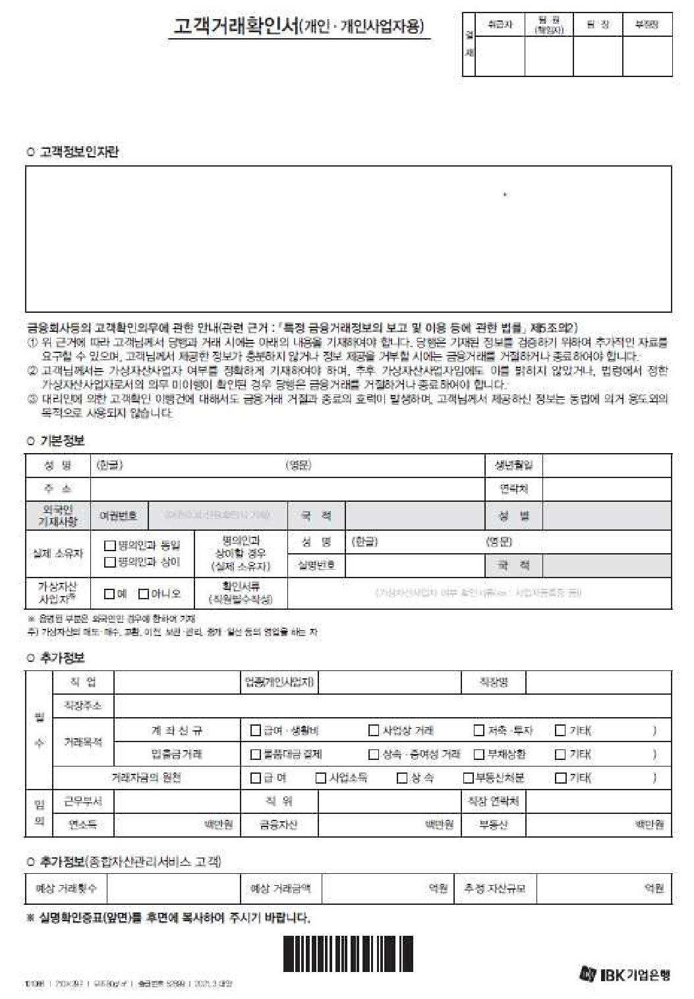
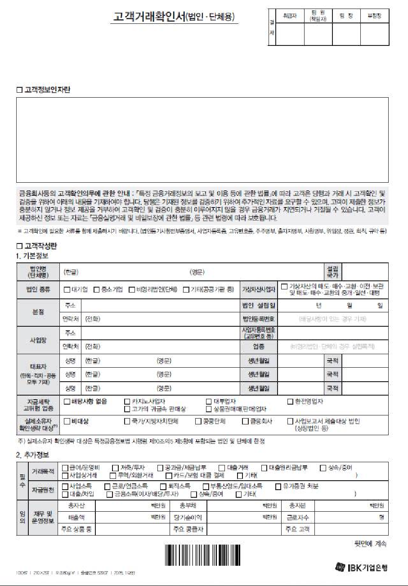
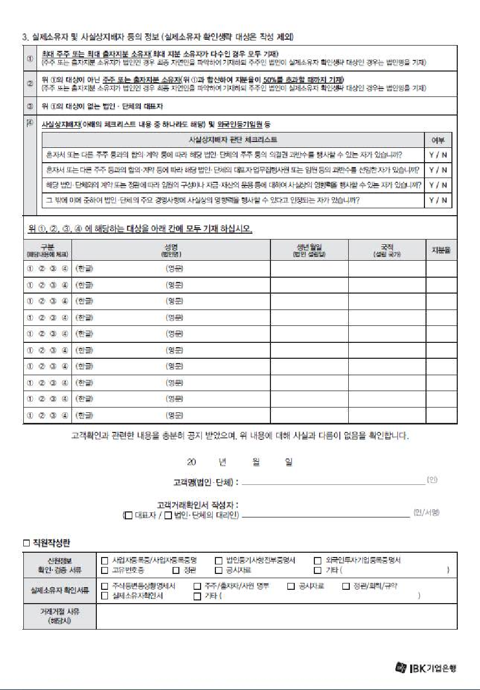
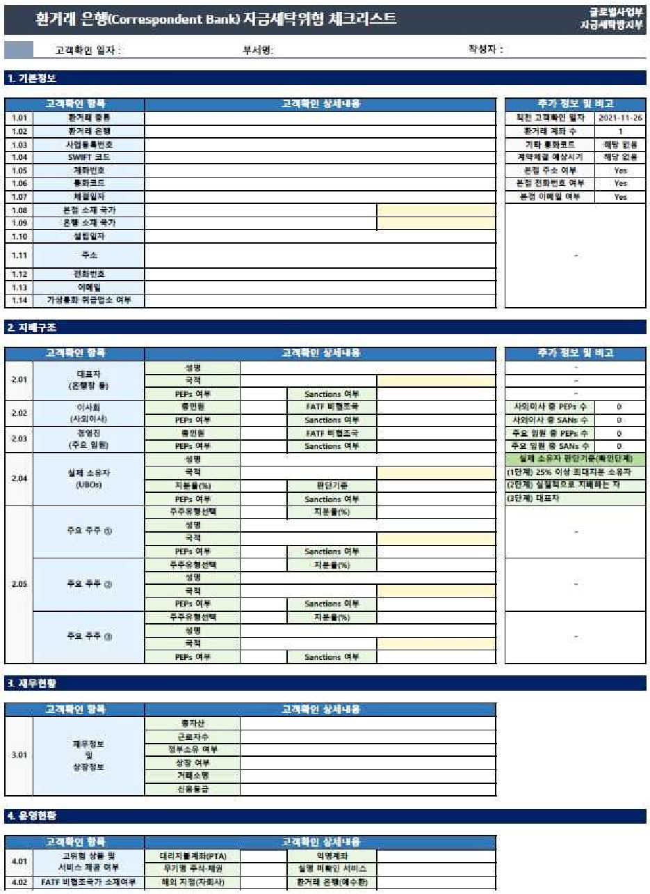
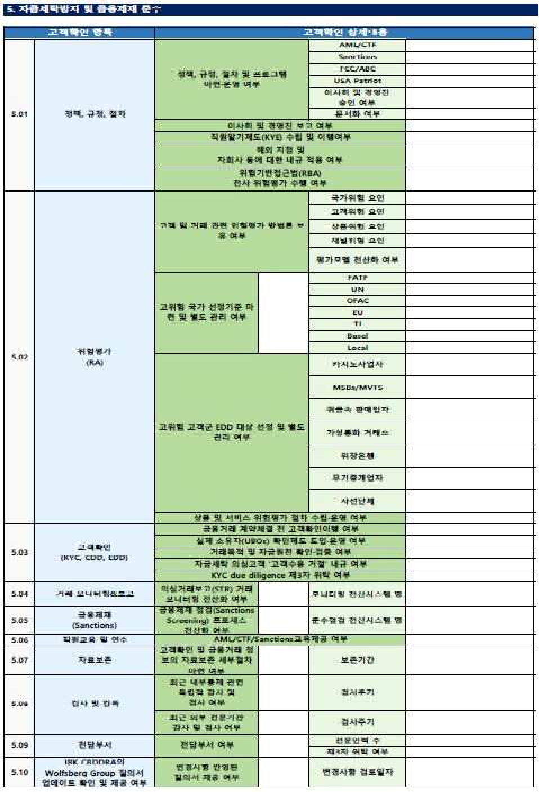

### 자금세탁방지업무 취급지침

- 2001.11.28. 제정
- 2002.11.11. 제1차 개정

2004. 1.20. 제2차 개정 2006. 1.16. 제3차 개정 2006. 4. 5. 제4차 개정 2008. 3.10. 제5차 개정

- 2008.12.19. 제6차 개정
- 2009. 4.15. 제7차 개정
- 2010. 8. 6. 제8차 개정
- 2011. 2. 8. 제9차 개정

- 2011. 5.27. 제10차 개정
- 2012. 6. 1. 제11차 개정 (전부개정)
- 2013. 3.25. 제12차 개정

- 2013. 8.22. 제13차 개정

- 2013.11.12. 제14차 개정
- 2014. 4.18. 제15차 개정

- 2014.10. 2. 제16차 개정
- 2015. 2.26. 제17차 개정
- 2016. 1.18. 제18차 개정

- 2016. 7. 1. 제19차 개정
- 2017.11. 2. 제20차 개정
- 2018. 2.20. 제21차 개정

2018. 5.14. 제22차 개정 2018. 8.21. 제23차 개정

- 2018.10.30. 제24차 개정
- 2019. 6.27. 제25차 개정

2021. 3.23. 제26차 개정

- 2023.11. 9. 제27차 개정
- 2024. 3.18. 제28차 개정

- 2024. 6.28. 제29차 개정

- 2024.11. 4. 제30차 개정
- 2025. 1.16. 제31차 개정

- 2025. 5.22. 제32차 개정

- 2025. 9.18. 제33차 개정
- 2026. 1.16. 제34차 개정

### 제1장 총 칙

- 제1조(목적) 이 지침은 「자금세탁방지업무 취급규정」에서 위임된 사항과 그 시행에 필요한 사항을 정하는데 그 목적이 있다.

- 제2조(적용범위) 자금세탁방지 및 공중협박자금·대량살상무기확산자금조달금 지(이하 “자금세탁방지등” 이라 한다)등의 업무에 대하여 관계법령, 금융정 보분석원(KoFIU), 감독기관 등이 따로 정한 사항 및 「자금세탁방지업무 취 급규정」에서 정한 사항을 제외하고는 이 지침에서 정한 바에 따른다.<개정 2018.2.20., 2019.6.27., 2021.3.23., 2025.5.22.>
- 제3조(용어의 정의) 이 지침에서 사용하는 용어의 정의는 「자금세탁방지업무 취급규정」및 관련 법령에서 정하는 바에 따른다.<개정 2018.2.20., 2021.3.23., 2025.5.22.>

### 제2장 내부통제 <신설 2025.5.22.>

### 제1절 구성원별 역할 및 책임 <신설 2025.5.22.>

- 제3조의2(전담부서) 자금세탁방지등 업무의 전담부서는 자금세탁방지부로 하며, 독립적이고 효율적으로 업무를 수행할 수 있도록 적정규모의 인원을 두어야 한다.

[본조신설 2025.5.22.]

- 제3조의3(실무전담직원) ① 실무전담직원은 다음 각 호의 1에 해당하는 자로 지정한다.

- 1. 실무경험이 2년 이상인 자로서 자금세탁방지등 업무에 필요한 지식과 경 험이 있는 자
- 2. 보고책임자가 자금세탁방지등 업무에 적합하다고 인정하는 자

- ② 실무전담직원을 배치·이동할 경우 인사담당부서(인사부)는 보고책임자와 사전에 협의하여야 한다.
- ③ 실무전담직원의 업무는 다음 각 호와 같다.

- 1. 부점에서 수행한 고객확인 이행결과에 대한 주기적 검토

- 2. 부점으로부터 보고받거나 거래 모니터링을 통해 인지한 의심되는 거래 검 토
- 3. 고액 현금거래에 대한 검토
- 4. 고유위험 및 거래위험 평가와 관리
- 5. 요주의리스트 관리
- 6. 기타 보고책임자 지시에 따른 자금세탁방지등 관련 업무

[본조신설 2025.5.22.]

###### 제3조의4(전산담당직원) ① 자금세탁방지등 업무 관련하여 전산담당직원을 2명 이상 지정·운용하여야 한다.

- ② 전산담당직원의 업무는 다음 각 호와 같으며, 타 업무를 겸임할 수 있다.

- 1. 고액 현금거래 보고대상 거래의 추출, 보고서 작성 및 보고
- 2. 고액 현금거래 보고 관련 전산시스템 운영 및 관리
- 3. 의심되는 거래 보고 관련 전산시스템 운영 및 관리
- 4. 고객확인 관련 전산시스템 운영 및 관리
- 5. 기타 자금세탁방지 모니터링 시스템 운영 및 관리

- ③ 전산담당부서(IT금융개발부)의 장은 전산담당직원의 지정·운영·배치에 협조하여야 한다.

[본조신설 2025.5.22.]

###### 제3조의5(담당책임자) ① 담당책임자는 여·수신 및 외환업무 등 경험이 있는 책임자 중 부점장이 지정하는 자로 한다.

###### ② 담당책임자의 업무는 다음 각 호와 같다.

- 1. 자금세탁방지등 업무 관련 소속직원에 대한 교육, 상담 및 지도
- 2. 의심되는 거래 보고대상여부 판단
- 3. 보고서 작성 및 보고
- 4. 신고대상거래의 관할 수사기관 앞 신고
- 5. 기타 자금세탁방지등 업무와 관련하여 필요한 사항 등

- ③ 제2항제3호의 보고서는 담당 직원이 작성하고 담당책임자가 검토·결재 한 후 보고한다.

[본조신설 2025.5.22.]

- 제3조의6(협의체 운영) 은행은 자금세탁방지등의 업무를 효과적으로 운영하기 위하여 협의체를 운영할 수 있다.

[본조신설 2025.5.22.]

### 제2절 직원알기제도 <개정 2025.5.22.>

- 제4조(적용대상) 국내 및 국외(해외지점 및 현지법인 포함) 임직원을 대상으로 한다.

[본조신설 2017.11.2.]

- 제5조(신원사항 확인) 임직원의 신규 채용을 담당하는 부점장은 임직원에 대해 다음 각 호의 정보를 확인·검증한다.

- 1. 성명
- 2. 실명번호(외국인의 경우 생년월일 및 성별)
- 3. 주소 및 연락처
- 4. 국적(외국인의 경우에 한함)

[본조신설 2017.11.2.]

- 제6조(지속적인 직원확인) ① 보고책임자는 임직원 명부 등을 제공받아 다음 각 호와 같이 임직원이 외국의 정치적 주요인물이나 금융거래등제한대상자 등 요주의 인물인지 여부를 확인한다.<개정 2024.6.28., 2025.5.22., 2026.1.16.>

- 1. 신규채용 임직원 : 매 신규채용 시 채용 전에 확인
- 2. 재직 임직원 : 전년말 현재 재직 임직원은 매년 1월중 확인

- ② 보고책임자는 임직원이 관련된 금융사고, 고소·고발사건 등을 제공받아

- 사고발생 부점의 의심되는 거래 보고 여부 등을 검토한다.<개정 2025.5.22.>
- ③ 보고책임자는 임직원의 금융거래 모니터링에 필요한 룰을 운영하며, 자금 세탁방지부의 실무 전담직원이 모니터링을 담당한다.<개정 2018.5.14., 2025.5.22.>

[본조신설 2017.11.2.]

###### 제7조(위험식별 및 내부통제) ① 보고책임자는 임직원이 관련된 금융사고 분석 등을 통해 임직원의 자금세탁 위험을 식별하고 분석한다.<개정 2025.5.22.>

- ② 보고책임자는 제1항에서 확인한 자금세탁방지 취약점을 소관업무 부서장 에게 통보하고 이의 개선을 요구한다.<개정 2025.5.22.>
- ③ 제2항의 개선요구를 접수한 소관업무 부서장은 업무절차, 시스템 개선 등 의 개선계획을 수립하고 그에 따른 조치결과를 보고책임자에게 보고하여야 한다.<개정 2025.5.22.>

[본조신설 2017.11.2.]

제3장 고객확인

제1절 통칙

###### 제8조(고객확인 절차의 운영) ① 고객과 금융거래를 하는 때에는 제2절의 고객 확인 적용대상에 대하여 제3절의 이행시기에 제4절의 위험평가 결과에 따라

제5절 내지 제7절에서 정하는 방법으로 고객확인(CDD) 또는 강화된 고객확 인(EDD)을 하여야 한다.

- ② 제1항에 불구하고 따로 정한 주요 고위험군에 대하여는 제4장에서 정한 바에 따른 강화된 고객확인을 하여야 한다.
- ③ 고객거래확인서 “별지서식 1호(고객거래확인서 개인·개인사업자용)”, “별지서식 2호(고객거래확인서 법인·단체용)”에 관한 전결권은 다음과 같 다.<신설 2013.3.25., 2018.8.21., 2019.6.27., 2024.3.18., 2025.9.18.>

- 1. 고객확인(CDD) : 책임자
- 2. 강화된 고객확인(EDD) : 팀장
- 3. 주요 고위험군(종합자산관리서비스 고객, FATF 지정위험국가의 고객, 외 국의 정치적 주요 인물 등) : 영업점장

### 제2절 적용대상

- 제9조(계좌신규개설 등) 계좌를 신규로 개설하는 경우 등 다음 각 호의 경우에 는 고객확인을 하여야 한다.<개정 2019.6.27.>

- 1. 예금계좌, 위탁매매계좌 등의 신규 개설
- 2. 보험·대출·보증·팩토링 계약의 체결
- 3. 양도성예금증서, 표지어음, 채권 등의 발행
- 4. 펀드 신규 가입
- 5. 대여금고 약정, 보관어음 수탁을 위한 계약
- 6. 금융거래를 개시할 목적으로 계약을 체결하는 것

- 제10조(일회성 금융거래) ① 다음 각 호의 기준금액 이상으로 일회성 금융거래 를 하는 경우에는 고객확인을 하여야 한다.<개정 2019.6.27., 2021.3.23.>

- 1. 전신송금 : 1백만원 또는 그에 상당하는 다른 통화로 표시된 금액
- 2. 외국통화로 표시된 외국환거래 : 1만 미합중국달러 상당액
- 3. 제1호 및 제2호 외의 금융거래 : 10백만원

- ② 제1항의 “일회성 금융거래”란 금융회사등과 계속하여 거래할 목적으로 계약을 체결하지 않은 고객에 의한 금융거래로 다음 각 호의 거래를 포함한

다.<개정 2013.3.25., 2014.4.18., 2019.6.27.>

- 1. 무통장 입금(송금)
- 2. 외화송금 및 환전
- 3. 자기앞수표 발행 및 지급
- 4. 당좌수표 및 어음 지급

- 5. 보호예수(봉함된 경우에는 기준금액 미만으로 봄)
- 6. 선불카드 매매
- 7. 증서식 CD·표지어음, 채권(통장거래 제외) 등의 지급

###### ③ 제1항의 기준금액 적용방법은 다음 각 호와 같다.

- 1. 단일거래뿐만 아니라 동일인 명의의 일회성 금융거래로서 7일 동안 합산 한 금융거래(이하 “연결거래” 라 한다)의 금액을 적용한다.
- 2. 원화와 외화가 혼합된 거래인 경우에는 각각의 거래로 구분하여 그 중 어 느 하나라도 기준금액에 해당하면 그 금액을 적용한다.
- 3. 미합중국달러 이외의 외화의 경우 현찰매매율 또는 전신환매매율 등 실제 거래된 환율을 적용하여 미합중국달러로 환산하여 적용한다.
- 4. 액면금액과 실제 거래된 금액이 다를 경우에는 실제 거래된 금액을 적용 한다.
- 5. 금액을 확인할 수 없는 경우에는 기준금액 미만으로 본다.

- 제10조의2(기타 고객확인이 필요한 거래) ① 고객이 실제 거래당사자 여부가 의심되는 등 자금세탁 및 공중협박자금·대량살상무기확산자금조달(이하 “자금세탁등” 이라 한다) 행위를 하고 있다고 의심되는 때에는 고객확인을 하여야 한다.<개정 2019.6.27.>

② 삭제<2019.6.27.> [본조신설 2013.3.25.]

- 제11조(인수·합병) 타금융회사를 인수·합병하는 경우에는 피인수금융회사 거 래고객에 대해서도 고객확인을 하여야 한다. 다만, 다음 각 호를 모두 충족 하는 경우에는 생략할 수 있다.<개정 2019.6.27.>

- 1. 피인수금융회사로부터 고객확인 이행에 대한 보증을 받고 관련 고객확인 이행자료를 입수한 경우
- 2. 제1호의 고객확인에 대한 표본추출 점검 등을 통하여 고객확인이 적정하 다고 판단되는 경우

- 제12조(해외지점 등) ① 해외지점 등은 자금세탁방지등에 관한 국내·외 법규 를 준수하여야 하며, 보고책임자는 이의 이행 여부를 관리하여야 한다. 다만, 현지법규의 기준이 국내기준과 다른 경우 자금세탁위험을 관리·경감할 수 있는 조치를 취하고 그 사실을 보고책임자에게 보고하여야 한다.<개정 2014.10.2., 2019.6.27., 2025.5.22.>

- ② 보고책임자는 국제자금세탁방지기구(이하 "FATF"이라 한다) 권고사항이 이행되지 않거나 불충분하게 이행되고 있는 국가에 소재한 해외지점 등에 대하여는 특별한 주의를 기울여야 한다.<개정 2014.10.2., 2019.6.27., 2025.5.22.>
- ③ 삭제<2019.6.27.>
- ④ 해외지점 등의 자금세탁방지업무에 대한 세부사항은 따로 정하는 바에 의한다.<신설 2021.3.23., 2025.5.22.>

[제목개정 2025.5.22.]

제3절 이행시기

- 제13조(이행시기) ① 고객확인은 고객이 계좌를 신규로 개설하기 전 또는 당해 금융거래가 완료되기 전까지 이행하여야 한다. 다만, 다음 각 호의 경우에는 각 호에서 정하는 고객확인 시기가 도래한 이후 지체 없이 고객확인을 이행 하여야 하며, 이 경우 고객이 내점하여 고객확인을 하기 전에는 입금 및 지 급을 제한할 수 있다.<개정 2013.8.22., 2019.6.27.>

- 1. 근로자·학생 등에 대한 일괄적인 계좌개설의 경우 : 계좌개설후 거래당 사자의 최초 금융거래시
- 2. 타인을 위한 보험의 경우 : 보험금, 만기환급금, 그 밖의 지급금액을 청구 권자에게 지급하는 때 또는 청구권이 행사되는 때
- 3. 일회성 금융거래로서 연결거래의 합산액이 기준금액 이상인 경우 : 동 거 래 후 창구를 이용한 최초의 실명확인대상 금융거래시

② 제1항제1호의 경우 일괄적인 계좌개설을 대행하는 사업주 등에 대하여는

계좌개설시에 고객확인을 하여야 한다.

###### 제14조(지속적 고객확인) ① 고객확인을 한 고객과 금융거래가 유지되는 동안 당해 고객에 대하여 주기적으로 고객확인을 하여야 한다.<개정 2014.4.18., 2019.6.27.>

- ② 고위험 고객은 1년, 저위험 고객은 3년을 주기로 고객확인을 재이행하여 야 한다.<신설 2019.6.27.>
- ③ 제2항에 따른 재이행 주기가 도래하지 않은 경우에는 고객확인을 생략할 수 있다. 다만, 기존의 확인사항이 사실과 일치하지 아니할 우려가 있거나 그 타당성에 의심이 있는 경우에는 고객확인을 하여야 한다.<신설 2019.6.27.>
- ④ 제2항에도 불구하고, 거래모니터링 결과 특이거래가 발견되거나 불법적인 계좌 사용이 의심되는 경우 등의 사유로 자금세탁 위험이 증가하였다고 판 단할 수 있는 경우 고객확인 재이행을 수행할 수 있다.<신설 2025.9.18.><종 전 제4항은 제5항으로 이동 2025.9.18.>
- ⑤ 고객확인을 위해 입수한 문서, 데이터 및 위험평가 결과 등은 지속적으로 비교·검토하여 관리하여야 한다. <제4항에서 이동 2025.9.18.>

###### 제15조(비대면거래) 전자금융에 의한 계좌개설 등 비대면 거래의 고객확인절차 는 다음 각 호에 따른다.<개정 2019.6.27.>

- 1. 복수의 비대면 실명확인방식을 적용하여 고객확인에 관한 신원정보를 확 인
- 2. 제1호의 방법으로 고객확인이 어려운 경우 해당 고객에게 영업점 방문을 통한 고객확인이 필요하다는 사실 고지
- 3. 제2호에 따라 고객이 영업점을 방문하여 실명확인대상 금융거래를 하거 나, 고객이 요청하는 때에 고객확인 이행

###### 제16조(고객공지) 은행은 고객확인을 위해 필요한 자료 등을 공지하여야 하며,

공지하는 때에는 다음 각 호의 내용이 포함되어야 한다.

- 1. 고객확인에 대한 법적 근거
- 2. 고객확인에 필요한 정보, 문서, 자료 등
- 3. 고객이 정보 등의 제출을 거부하거나, 검증이 불가능한 경우에 취하는 조 치 등

### 제4절 위험 평가

- 제17조(위험의 식별 및 평가) ① 고객확인의 효율적인 이행을 위하여 다음 각 호의 위험요소를 고려하여 자금세탁등과 관련된 위험을 식별하고 평가하여 야 한다.<개정 2013.3.25., 2019.6.27.>

- 1. 고유위험 : 국가위험, 고객위험, 상품 및 서비스 위험(새로운 기술 및 지 급·결제수단의 이용에 따른 것을 포함, 이하 같음) 등
- 2. 거래위험 : 거래기간, 거래금액, 거래횟수, 영업시간외 거래비율 등

② 제1항의 고유위험과 거래위험에 대한 종합평가결과에 따라 저위험과 고 위험으로 분류하며, 저위험으로 분류된 경우 제21조 및 제22조에 따라 고객 확인을 하고 고위험으로 분류된 경우 제23조에 따라 강화된 고객확인을 하 여야 한다.

- 제18조(국가위험 평가) 국가위험은 특정국가의 자금세탁방지제도와 금융거래 환경이 취약하여 발생할 수 있는 위험을 말하며, 다음 각 호와 같은 공신력 있는 기관의 자료를 활용하여 평가한다.<개정 2019.6.27., 2025.5.22.>

- 1. FATF가 성명서 등을 통해 발표하는 고위험 국가(Higher-risk countries) 리 스트
- 2. FATF가 이행 취약국가(Non-compliance)로 발표한 국가리스트
- 3. UN 또는 그 밖의 국제기구(World Bank, OECD, IMF 등)가 발표하는 제재, 봉쇄 또는 이와 유사한 조치와 관련된 국가리스트
- 4. 해외지점 등 소재 국가의 정부에서 자금세탁등의 위험이 있다고 발표하는

국가리스트

###### 5. 국제투명성기구 등이 발표하는 부패관련 국가리스트

- 제19조(고객위험 평가) ① 고객위험은 고객의 특성에 따라 다양하게 발생하는 자금세탁등의 위험을 말하며, 고객의 직업(업종)·거래유형 및 거래빈도 등을 활용하여 평가한다.

- ② 다음 각 호의 고객은 고객위험이 낮은 것으로 고려할 수 있다.<개정 2019.6.27., 2021.3.23.>

- 1. 국가기관, 지방자치단체, 공공단체
- 2. 「특정 금융거래 정보의 보고 및 이용 등에 관한법률」(이하 "특정금융정 보법" 이라 한다) 제2조 및 제15조에 따른 감독·검사의 대상인 금융회사 등(카지노사업자, 환전영업자, 소액해외송금업자 , 대부업자, 가상자산사업 자 제외)
- 3. 「유가증권시장 공시규정」 및 「코스닥시장 공시규정」에 따라 공시의무 를 부담하는 주권상장법인

- ③ 다음 각 호의 고객은 자금세탁등의 위험이 높은 것으로 고려하여야 한

###### 다.<개정 2018.2.20., 2019.6.27., 2021.3.23., 2026.1.16.>

- 1. 은행으로부터 종합자산관리서비스를 받는 고객 중 추가정보 확인이 필요 하다고 판단한 고객
- 2. 외국의 정치적 주요인물
- 3. 비거주자(다만, 자금세탁위험도를 고려하여 달리 정할 수 있다)
- 4. 대량의 현금(또는 현금등가물)거래가 수반되는 카지노사업자, 대부업자, 환 전영업자, 소액해외송금업자 등
- 5. 고가의 귀금속 판매상
- 6. 금융위원회가 「공중 등 협박목적 및 대량살상무기 확산을 위한 자금조달 행위의 금지에 관한 법률」(이하 "테러자금금지법" 이라 한다) 제4조제4항 에 따른 금융거래등제한대상자

- 7. UN(United Nations) 결의 제1267호(1999년)·제1989호(2011년) 및 제2253호

- (2015년), 제1718호(2006년), 제1737호(2006년), 제1988호(2011년)에 의거 국 제연합 안전보장이사회 또는 동 이사회 결의 제1267호(1999년)·제1989호 (2011년) 및 제2253호(2015년), 제1718호(2006년), 제1737호(2006년), 제1988 호(2011년)에 의하여 구성된 각각의 위원회(Security Council Comm ittee)가 지정한 자(이하 "UN에서 지정하는 제재대상자"라 한다)
- 8. 신탁받은 개인자산을 운영, 관리하기 위하여 별도로 설립된 법인 또는 단 체(「자본시장과 금융투자업에 관한 법률」에 의한 집합투자기구 및 신탁 업자는 제외)
- 9. 명의주주가 있거나 무기명주식을 발행한 회사
- 10. 가상자산사업자, 가상자산사업자 이용자

- 제20조(상품 및 서비스 위험 평가) ① 상품 및 서비스 위험은 상품 및 서비스 에 따라 다양하게 발생하는 자금세탁등의 위험을 말하며, 거래의 현금성, 역 외거래, 비대면 채널의 이용가능성 등의 평가요소를 이용하여 위험을 평가한

###### 다.<개정 2013.3.25.>

###### ② 다음 각 호의 경우 상품 및 서비스 위험이 낮은 것으로 고려할 수 있다.

- 1. 연간보험료가 300만원 이하 이거나 일시 보험료가 500만원 이하인 보험
- 2. 보험해약 조항이 없고 저당용으로 사용될 수 없는 연금보험
- 3. 연금, 퇴직수당 및 기타 고용인에게 퇴직 후 혜택을 제공하기 위하여 급 여에서 공제되어 조성된 기금으로서 그 권리를 타인에게 양도할 수 없는 것 등

###### ③ 다음 각 호의 상품 및 서비스는 제17조제2항에 따른 고위험으로 분류된 것으로 본다.<개정 2014.4.18., 2018.2.20., 2021.3.23.>

- 1. 양도성 예금증서(증서식 무기명), 중소기업금융채권(증서식 무기명), 표지 어음
- 2. 환거래 서비스
- 3. 비대면 거래
- 4. 가상자산 관련 상품 및 서비스(실명확인 입출금계정 서비스 포함)

###### 5. 정부 또는 감독기관에서 고위험으로 판단하는 상품 및 서비스 등

###### 제20조의2 삭제<2025.5.22.>

제5절 고객확인 및 검증

###### 제21조(개인고객의 확인·검증) ① 개인고객(개인사업자·외국인 포함, 이하 같 음)에 대하여는 “별지서식 1호(고객거래확인서 개인·개인사업자용)” 또는 이에 준하는 서류를 받아 다음 각 호의 신원정보를 확인하여야 한다.<개정 2016.1.18., 2018.2.20., 2019.6.27., 2021.3.23., 2025.5.22., 2025.9.18.>

- 1. 성명
- 2. 실명번호(외국인 비거주자의 경우 생년월일 및 성별)
- 3. 주소 및 연락처(외국인 비거주자의 경우 실제 거소 또는 연락처)
- 4. 국적(외국인의 경우에 한함)
- 5. 가상자산사업자 여부

- ② 개인고객에 대하여는 다음 각 호의 실제 소유자에 관한 사항을 확인하여 야 한다.<신설 2016.1.18.>

- 1. 성명
- 2. 실명번호
- 3. 국적(외국인의 경우에 한함)

- ③ 개인고객에 대해 검증하여야 하는 신원정보는 다음 각 호와 같다.<신설 2019.6.27., 2025.5.22.>

- 1. 성명
- 2. 실명번호(외국인 비거주자의 경우 생년월일)
- 3. 주소 및 연락처(외국인 비거주자의 경우 실제 거소 또는 연락처)
- 4. 국적(외국인의 경우에 한함)

- ④ 제3항의 신원정보는 다음 각 호의 방법으로 검증한다.<개정 2019.6.27., 2025.5.22.>

- 1. 문서적 방법 : 주민등록등본, 재직증명서, 이름과 주소가 명시되어 있는 전기·가스·수도요금청구서 또는 영수증 등
- 2. 비문서적 방법 : 1382 전화를 통한 주민등록증 발급일자 확인, 전자정부 홈페이지를 통한 주민등록증 진위여부 확인, 경찰청홈페이지를 통한 운전 면허증 진위여부 확인, 연락처 직접 전화확인, 신용정보기관을 통한 확인, 본인음성 녹취 등

- ⑤ 자금세탁 등의 위험이 낮은 경우로서 다음 각호의 방법으로 고객의 신원 을 확인한 때에는 제3항의 검증을 이행한 것으로 본다. 이 경우 실명확인증 표의 진위여부에 주의를 기울여야 한다.<개정 2014.10.2., 2019.6.27.>

- 1. 주민등록증 또는 운전면허증과 같이 사진이 부착되어 있는 실명확인증표 로 제1항의 신원정보(연락처 제외)를 모두 확인한 경우
- 2. 학생·군인·경찰·교도소 재소자 등에 대해「금융실명거래 및 비밀보장 에 관한 법률」(이하 “금융실명법”이라 한다) 상의 실명확인서류 원본에 의해 실명을 확인한 경우

- 제22조(법인고객의 확인·검증) ① 법인고객(영리법인, 비영리법인, 외국법인 포함, 이하 같음)에 대하여는 “별지서식 2호 (고객거래확인서 법인·단체 용)”를 받아 다음 각 호의 신원정보를 확인하고 사업의 성격 등을 이해하여 야 한다.<개정 2016.1.18., 2018.2.20., 2018.8.21., 2019.6.27., 2021.3.23., 2025.5.22.>

- 1. 법인(단체)명
- 2. 실명번호
- 3. 본점주소 및 사업장의 주소·소재지(외국법인의 경우 연락 가능한 실제 사업장 소재지)
- 4. 대표자의 성명, 생년월일 및 국적
- 5. 업종(영리법인의 경우) 또는 설립목적(비영리법인의 경우)
- 6. 회사 연락처
- 7. 가상자산사업자 여부

###### 8. 신탁의 경우 위탁자, 수탁자, 신탁관리인 및 수익자에 대한 신원정보

###### ② 법인고객에 대하여는 다음 각 호의 실제 소유자에 관한 사항을 확인하여 야 한다.<신설 2016.1.18., 2025.5.22.>

- 1. 성명
- 2. 생년월일
- 3. 국적(외국인의 경우에 한함)

###### ③ 법인고객에 대해 검증하여야 하는 신원정보는 다음 각 호와 같다.<신설 2019.6.27.>

- 1. 법인(단체)명
- 2. 실명번호
- 3. 본점 및 사업장의 주소·소재지(외국법인의 경우 연락 가능한 실제 사업 장 소재지)
- 4. 업종(영리법인의 경우) 또는 설립목적(비영리법인의 경우)

###### ④ 제3항의 신원정보는 다음 각 호의 방법으로 검증하여야 한다.<개정 2019.6.27.>

- 1. 문서적 방법 : 사업자등록증, 고유번호증, 납세번호증, 사업자등록증명원, 법인등기부등본, 영업허가서, 정관 등
- 2. 비문서적 방법 : 전자공시, 상용 기업정보 제공 데이터베이스 등

###### ⑤ 제19조제2항 각 호의 고객에 대하여는 자금세탁등 위험이 낮은 것으로 평가된 경우에 한해 제3항의 검증을 생략할 수 있다.<개정 2019.6.27.>

- 제23조(강화된 고객확인) ① 자금세탁등의 고위험으로 분류된 개인고객에 대하 여는 “별지서식 1호(고객거래확인서 개인·개인사업자용)” 또는 이에 준하 는 서류를 받아 제21조제1항 및 제2항의 기본정보 이외에 다음 각 호의 추 가정보를 확인하여야 한다.<개정 2013.8.22., 2016.1.18., 2025.9.18.>

- 1. 필수추가정보 : 직장명, 직업 또는 업종(개인사업자), 직장주소, 거래의 목 적, 거래자금의 원천
- 2. 임의추가정보 : 연락처·근무부서·직위 등 직장관련 정보, 재산현황 등

- ② 자금세탁등의 고위험으로 분류된 법인고객에 대하여는 “별지서식 2호 (고객거래확인서 법인·단체용)”를 받아 제22조제1항 및 제2항의 기본정보 이외에 다음 각 호의 추가정보를 확인하여야 한다.<개정 2013.8.22., 2016.1.18.>

- 1. 필수추가정보 : 법인구분정보(대기업, 중소기업 등), 상장정보(거래소, 코스 닥 등), 설립일, 거래의 목적, 거래자금의 원천
- 2. 임의추가정보 : 주요상품, 근로자 수, 매출액, 총자산, 총자본, 총부채 등

- ③ 자금세탁등의 고위험으로 분류된 상품 및 서비스를 거래하고자 하는 경 우에도 제1항 및 제2항에서 정한 방법으로 고객확인을 하여야 한다.
- ④ 최근 3개월 동안 3회 초과하여 의심되는 거래 보고가 발생한 고객과 거 래하고자 하는 경우에도 제1항 및 제2항에서 정한 방법으로 고객확인을 하 여야 한다.<신설 2014.4.18.>

- 제24조(실제 소유자 확인 방법) ① 제21조제2항 및 제22조제2항의 실제 소유자 는 고객을 최종적으로 지배하거나 통제하는 자연인으로 다음 각 호의 방법 으로 확인하여야 한다.<개정 2024.3.18.>

- 1. 개인고객의 경우에는 기본적으로 고객과 실제 소유자가 동일하다고 추정 하며, 고객이 타인을 위한 거래를 하고 있다고 의심되거나 고객이 실제 소 유자가 따로 존재한다고 밝힌 경우 실제 소유자를 확인하여야 한다.
- 2. 법인고객의 경우 다음 각 목의 어느 하나에 해당하는 자에 관한 사항을 확인해야 하며 이 경우 가목에 해당하는 자가 없을 때에는 나목에 해당하 는 자를, 나목에 해당하는 자를 확인할 수 없을 때에는 다목에 해당하는 자를 확인하여야 한다.

- 가. 의결권 있는 발행주식 총수의 25%이상 지분증권을 소유한 자연인
- 나. 실질적으로 지배하는 자로서 다음 어느 하나에 해당하는 자

- 1) 최대지분을 소유한 주주
- 2) 대표자·업무집행사원 또는 임원 등의 과반수를 선임한 주주
- 3) 1) 및 2)외에 법인을 사실상 지배하는 자

###### 4) 3)의 지배자는 다음과 같이 확인한다.

- 가) 계약에 따른 인도청구권 보유자
- 나) 계약에 따른 의결권 보유자
- 다) 계약에 따른 해당 주식등의 취득 또는 처분 권한 보유자
- 라) 계약에 따른 해당 주식등의 매수인 지위 보유자
- 마) 주식매수선택권 행사에 따른 매수인 지위 보유자
- 바) 역외펀드 고객의 경우 해당 자산운용사 대표자

###### 다. 법인의 대표자

- ② 제24조제1항제2호의 가목 또는 나목의 1)에 따른 실제 소유자가 법인일 경우 그 법인의 중요한 경영사항에 대해서 사실상 영향력을 행사할 수 있는 사람을 제24조제1항제2호의 가목 또는 나목의 방법에 따라 확인한다.
- ③ 제1항 및 제2항을 적용할 때 제1항 제2호의 가목 및 나목의 자(제2항에 따라 실제소유자가 법인일 경우 그 법인의 중요한 경영사항에 대해서 사실 상 영향력을 행사할 수 있는 사람을 제24조제1항제2호의 가목 또는 나목의 방법에 따라 확인하는 경우도 포함)가 여러 명인 경우에는 의결권 있는 발행 주식총수를 기준으로 소유하는 주식, 그 밖의 출자지분의 수가 가장 많은 주 주등을 기준으로 확인해야 한다. 다만, 금융거래등을 이용한 자금세탁행위 및 공중협박자금조달행위를 방지하기 위하여 필요하다고 인정되는 경우에는 제1항 제2호의 가목 및 나목에 해당하는 자의 전부 또는 일부를 확인할 수 있다.<신설 2025.5.22.><종전 제3항은 제4항으로 이동 2025.5.22.>
- ④ 제1항 및 제2항에도 불구하고 법인고객이 다음 각 호의 어느 하나에 해 당하는 경우에는 실제 소유자의 확인을 하지 아니할 수 있다.<개정 2019.6.27., 2021.3.23., 2024.3.18.><제3항에서 이동 2025.5.22.>

- 1. 국가, 지방자치단체
- 2. 다음 각 목의 어느 하나에 해당하는 공공단체

- 가. 「공공기관의 운영에 관한 법률」에 따른 공공기관
- 나. 「정부출연연구기관 등의 설립·운영 및 육성에 관한 법률」 및 「과 학기술분야 정부출연연구기관 등의 설립·운영 및 육성에 관한 법률」

- 에 따라 설립된 정부출연연구기관, 과학기술분야 정부출연연구기관 및 연구회
- 다. 「지방공기업법」에 따라 설립된 지방직영기업·지방공사 및 지방공단
- 라. 다음의 어느 하나에 해당하는 법인 중 자금세탁과 공중협박자금조달의 위험성이 없는 것으로 판단되어 금융정보분석원장이 지정하는 자

- 1) 법률에 따라 정부로부터 출자·출연·보조를 받는 법인
- 2) 법률에 따라 설립된 법인으로서 주무부장관의 인가 또는 허가를 받지 않고 그 법률에 따라 직접 설립된 법인

- 3. 금융회사 등(카지노사업자, 환전영업자, 소액해외송금업자, 대부업자, 가상 자산사업자 제외)
- 4. 「자본시장과 금융투자업에 관한 법률」 제159조제1항에 따른 사업보고서 제출대상법인

- ⑤ 제1항부터 제3항의 내용에도 불구하고 테러자금금지법 제4조에 따라 법 인·단체의 실제소유자 및 사실상지배자에 대한 추가적인 확인이 필요한 경 우에는 법률이 요구하는 범위까지 다수의 실제소유자 및 사실상지배자를 확 인해야 한다.<신설 2026.1.16.>

[전문개정 2016.1.18.]

- 제25조(대리인에 대한 고객확인) 개인 및 법인 또는 그 밖에 단체를 대신하여 금융거래를 하는 자(이하 “대리인” 이라 한다)에 대해서는 그 권한이 있는 지를 확인하고, 해당 대리인에 대해서도 고객확인을 하여야 한다.

- 제26조(고객확인 면제거래) 다음 각 호의 금융거래등에 대하여는 고객확인을 면제한다.<개정 2026.1.16.>

- 1. 「금융실명법」제3조제2항제1호, 동법 시행령 제4조제1항제2호 및 제3호 에서 정하는 각종 공과금 등의 수납
- 2. 「금융실명법」제3조제2항제3호, 동법 시행령 제4조제2항 및 제3항에서 정하는 채권의 거래

- 3. 법원공탁금, 정부·법원보관금, 송달료의 지출
- 4. 보험기간의 만료시 보험계약자, 피보험자 또는 보험수익자에 대하여 만기 환급금이 발생하지 아니하는 보험계약

- 제26조의2(요주의 인물 여부 확인) ① 금융거래가 완료되기 전에 다음 각 호와 같은 요주의 인물 리스트 정보와의 비교를 통해 당해 거래고객(대리인, 실제 소유자 및 법인·단체 고객의 경우 대표자를 포함한다)이 요주의 인물인지 여부를 확인하여야 한다.<개정 2019.6.27. 2025.5.22., 2026.1.16.>

- 1. 테러자금금지법 제4조제4항에 따른 금융거래등제한대상자
- 2. UN에서 지정하는 제재대상자
- 3. UN 또는 그 밖의 국제기구(World Bank, OECD, IMF 등)가 발표하는 제재, 봉쇄, 또는 이와 유사한 조치와 관련된 리스트
- 4. FATF에서 발표하는 고위험국가 및 이행 취약국가의 국적자(개인, 법인 및 단체를 포함한다) 또는 거주자
- 5. 해외지점 등 소재 국가의 정부에서 자금세탁등의 위험을 고려하여 발표한 금융거래등제한대상자 리스트

- 6. 외국의 정치적 주요인물리스트 등

- ② 거래 고객이 요주의리스트에 등재된 인물로 판명되는 경우 금융거래를 거절하거나 거래관계 성립을 위해 고위경영진의 승인을 얻는 등 필요한 조 치를 취하여야 한다.
- ③ 은행은 제1항의 요주의리스트를 최신의 정보로 유지하여야 한다.

[제27조의2에서 이동]

- 제27조(고객확인 및 검증 거절시 조치) ① 다음 각 호의 어느 하나에 해당하는 경우에는 계좌 개설 등 해당 고객과의 신규 거래를 거절하고, 이미 거래관계 가 수립되어 있는 경우에는 해당 거래를 종료하여야 한다.<개정 2016.1.18., 2021.3.23., 2026.1.16.>

###### 1. 고객이 신원확인 등을 위한 정보 제공을 거부하는 등 고객확인을 할 수

없는 경우

###### 2. 가상자산사업자인 고객이 다음 각 목의 어느 하나에 해당하는 경우

- 가. 특정금융정보법 제7조제1항 및 제2항에 따른 신고 및 변경신고 의무를 이행하지 아니한 사실이 확인된 경우
- 나. 특정금융정보법 제7조제3항제1호 또는 제2호에 따라 정보보호 관리체 계 인증을 획득하지 못하였거나 실명확인 입출금계정 서비스를 통해 금 융거래등을 하지 않은 사실이 확인된 경우
- 다. 특정금융정보법 제7조제3항에 따라 신고가 수리되지 아니한 사실이 확 인된 경우
- 라. 특정금융정보법 제7조제4항에 따라 신고 또는 변경신고가 직권으로 말 소된 사실이 확인된 경우

- 마. 가상자산사업자가 테러자금금지법 제4조에 따른 금융거래등제한대상자 와 금융거래등을 한 사실이 밝혀진 경우

###### ② 제1항의 경우 제53조에 따른 방법으로 의심되는 거래 보고 여부를 검토 하여야 한다.<신설 2016.1.18.>

###### 제27조의2(누설 금지) 고객의 자금세탁행위등이 의심되나, 고객확인 절차를 수 행하는 것이 비밀 누설의 우려가 있다고 합리적으로 판단되는 경우에는 고 객확인 절차를 중단하고 의심되는 거래보고 의무를 이행하여야 한다.

[본조신설 2025.5.22.]

제6절 전신송금

###### 제28조(적용대상) 100만원(외화의 경우 1천 미합중국달러 또는 그에 상당하는 다른 통화로 표시된 금액)을 초과하는 국내·외 전신송금에 대하여는 송금인 및 수취인과 관련된 정보를 확인하고 보관하여야 한다. 다만, 다음 각 호의 거래에는 적용하지 않을 수 있다.<개정 2014.10.2., 2019.6.27.>

- 1. 현금카드, 직불카드 또는 체크카드 등에 의한 출금을 위한 이체

- 2. 카드 가맹점에서 신용카드, 직불카드 또는 체크카드 등에 의한 상품 및 서비스구입에 대한 지불을 위한 이체
- 3. 신용카드에 의한 현금 또는 대출서비스를 위한 이체
- 4. 금융회사 상호간의 업무를 수행하기 위한 자금이체와 결제 등

- 제29조(송금 금융회사의 의무) ① 당행이 송금 금융회사인 경우에는 자금이체 건별로 다음 각 호의 구분에 따라 송금관련 정보를 보관하고 이를 중개금융 회사 또는 수취금융회사에게 제공하여야 한다.<개정 2014.10.2., 2019.6.27.>

###### 1. 국내송금

- 가. 송금인의 성명(법인의 경우에는 법인의 명칭을 말한다. 이하 같다)
- 나. 송금인의 계좌번호(계좌번호가 없는 경우에는 참조 가능한 번호를 말 한다. 이하 같다)
- 다. 수취인의 성명 및 계좌번호

###### 2. 해외송금

- 가. 송금인의 성명
- 나. 송금인의 계좌번호
- 다. 송금인의 주소 또는 주민등록번호(법인인 경우에는 법인등록번호, 외국 인인 경우 에는 여권번호 또는 외국인등록번호를 말한다)

###### ② 국내송금으로서 다음 각 호의 1에 해당하는 경우 제1항제2호다목의 정보 를 제공할 수 있다.<신설 2014.10.2., 2019.6.27.>

- 1. 수취금융회사가 금융정보분석원장 앞 의심되는 거래 보고를 위하여 요청 하는 경우
- 2. 금융정보분석원장이 보고받은 정보를 심사·분석하기 위하여 요청하는 경 우

###### ③ 해외송금 시 고객으로부터 의뢰받은 여러 개의 송금을 묶음 형태로 일괄 송금하는 경우에도 제1항을 적용한다.<신설 2019.6.27.>

[제목개정 2019.6.27.]

- 제30조(중개 금융회사 및 수취금융회사의 의무) ① 당행이 중개 금융회사인 경 우에는 송금 금융회사 등으로부터 제29조 제1항에 따라 제공받은 정보(이하 “전신송금정보”라 한다)를 수취 금융회사 등에 제공하여야 한다. 다만, 기 술적 제약 등으로 전자적 방식에 의한 제공이 어려운 경우에는 수취 금융 회사등의 요청에 따라 3일 이내에 다른 방법으로 전신송금정보를 제공해야 한다.<개정 2019.6.27.>

- ② 당행이 중개·수취 금융회사인 경우 송금인 또는 수취인 정보의 누락이 있는지 여부를 확인하기 위한 모니터링 등 합리적 조치를 취하여야 한다.<신 설 2019.6.27.>
- ③ 당행이 중개·수취 금융회사인 경우 송금인 또는 수취인 정보가 누락된 전신송금에 대해 정보의 제공을 송금 금융회사에 요청하거나 거래를 거절할 것인지 등의 조치에 관한 위험기반 업무처리기준 및 절차를 수립·운영하여 야 한다.<신설 2019.6.27.>

[제목개정 2019.6.27.]

- 제31조 삭제<2019.6.27.>
- 제32조(관련정보의 보관) 전신송금정보는 당해거래 완료후 5년간 보관하여야 한다.<개정 2019.6.27.>

제7절 제3자를 통한 고객확인 이행

- 제33조(제3자를 통한 고객확인) ① 제3자를 통한 고객확인이란 금융회사등이 금융거래를 할 때마다 자신을 대신하여 타인인 제3자로 하여금 고객확인 하 도록 하거나 타인인 제3자가 이미 당해고객에 대하여 고객확인을 통해 확보 한 정보 등을 자신의 고객확인에 갈음하여 이를 활용하는 것을 말한다.<개정 2019.6.27.>

###### ② 국외에 소재하는 제3자를 통한 고객확인은 허용되지 아니한다.<신설

2019.6.27.>

###### 제34조(이행요건) 제3자를 통해 고객확인을 하고자 하는 경우 제3자는 다음 각 호를 충족하여야 한다.<개정 2019.6.27.>

- 1. 제3자는 고객확인과 관련된 필요한 정보를 당행에 즉시 제공할 것
- 2. 제3자는 당행의 요구가 있는 경우 고객 신원정보 및 기타 고객확인과 관 련된 문서사본 등의 자료를 지체없이 제공할 것
- 3. 제3자가 자금세탁방지등과 관련하여 감독기관의 규제 및 감독을 받고 있 어야 하고 고객확인을 위한 조치를 마련하고 있을 것
- 4. 삭제<2019.6.27.>

###### 제35조(최종책임) 제3자를 통한 고객확인의 경우 고객확인의 최종책임은 제3자 를 활용하여 고객확인을 하고자 하는 금융회사에 있다.<개정 2019.6.27.>

제4장 주요 고위험군에 대한 강화된 고객확인

제1절 환거래계약

###### 제36조(환거래계약과 고객확인) ① 환거래계약이란 은행(환거래은행)이 금융상 품 및 서비스를 국외 은행(환거래요청은행)의 요청에 의해 제공하는 관계를 수립하는 것을 말한다.<개정 2014.10.2.>

- ② 새로운 환거래계약을 체결하는 경우 미리 임원 등 고위경영진의 승인을 얻어야 한다.<신설 2025.5.22.><종전 제2항은 제3항으로 이동 2025.5.22.>
- ③ 환거래계약 담당부서(글로벌사업부)는 해외금융회사와 환거래계약을 체결 하고자 하는 경우에는 환거래 요청은행에 대하여 고객확인을 하여야 한다. 다만, 무예치환거래계약의 경우에는 생략할 수 있다.<신설 2014.10.2., 2019.6.27.><제2항에서 이동 2025.5.22.>

###### 제37조(환거래요청은행에 대한 고객확인) ① 환거래계약을 체결하는 경우에는 다음 각 호의 정보를 확인한다.

- 1. 법인(단체)명
- 2. 본점주소 및 사업장의 주소·소재지
- 3. 대표자 성명, 국적 및 생년월일
- 4. 연락처(전화번호, 전자우편주소)

- ② 환거래요청은행이 FATF회원국의 은행, 국제적인 지역개발은행 및 무역은 행(EBRD, IMF, WB 등) 이외의 은행인 경우에는 다음 각 호의 정보를 추가로 확인하여야 한다.<개정 2019.6.27., 2025.9.18.>

- 1. 주요 제공서비스 및 고객유형
- 2. 대리지불계좌 존재여부
- 3. 자금세탁방지등의 이행수준

- ③ 환거래계약 담당부서는 환거래계약 체결 전 다음 각 호의 절차를 수행하 여야 한다.<신설 2019.6.27.>

- 1. “별지서식 4호(환거래은행 자금세탁위험 체크리스트)”를 통해 자금세탁 위험을 사전점검
- 2. 자금세탁위험 경감·관리 조치를 포함하여 자금세탁방지부에 심사 의뢰

- ④ 실제로 존재하지 않는 은행 또는 감독권이 미치지 않는 지역 또는 국가 에 설립된 은행(이하 “위장은행” 이라 한다)과는 환거래계약을 체결하거나 거래를 계속할 수 없다.

###### 제38조(환거래계약의 내용) 환거래계약의 내용에는 다음 각 호의 내용이 포함 되어야 한다.<개정 2019.6.27., 2025.5.22.>

- 1. 환거래요청은행의 계좌가 위장은행에 이용되는 것을 금지한다는 내용
- 2. 환거래요청은행이 환거래계좌를 제3의 은행에게 중복계좌로 허용하고자 하는 경우에는 제3의 은행에 대하여 자금세탁방지등 활동을 조사할 것을 요구하는 내용
- 3. 환거래요청은행이 환거래계좌를 대리지불계좌로 허용하고자 하는 경우에

- 는 자신의 고객에 대하여 고객확인을 이행한다는 내용 및 당행의 요청시 환거래계좌를 이용한 고객의 정보를 제공한다는 내용
- 4. 환거래은행 및 환거래요청은행간 자금세탁방지등 각각의 책임의 문서화

### 제2절 종합자산관리서비스 고객

- 제39조(종합자산관리서비스 고객에 대한 고객확인) ① 은행이 투자자문을 비롯 한 법률, 세무 등 종합적인 자산관리서비스를 제공하는 개인으로서 최근 3개 월간 평균 금융자산이 20억원 이상인 고객(이하 “종합자산관리서비스 고 객” 이라 한다)에 대하여는 제23조에 따라 강화된 고객확인을 이행하고 다 음 각 호의 정보를 추가로 확인하여야 한다.<개정 2013.3.25.>

- 1. 거래계좌의 향후 1개월간 예상거래 횟수 및 예상거래 금액
- 2. 추정 자산규모

② 종합자산관리서비스 고객에 대한 계좌 신규개설 등 고객확인대상 금융거 래시에는 영업점장의 승인을 득하여야 한다.

- 제40조(모니터링) ① 종합자산관리서비스 고객과의 금융거래에 대하여는 지속 적인 모니터링을 하여야 한다.

② 자금세탁행위등의 위험이 특히 높다고 판단되는 종합자산관리서비스 고 객에 대해서는 업무상 또는 조직체계상 금융거래 승인부서와 독립된 부서에 서 지속적으로 모니터링 하도록 조치하여야 한다.<신설 2025.5.22.>

제3절 외국의 정치적 주요인물

- 제41조(외국의 정치적 주요인물) ① 외국의 정치적 주요인물이란 현재 또는 과 거에 외국에서 정치적·사회적으로 영향력을 가진 자, 그의 가족 또는 그와 밀접한 관계가 있는 자를 말한다.<개정 2019.6.27.>

- ② 제1항에 따른 정치적·사회적으로 영향력을 가진 자란 다음 각 호와 같

###### 다.<개정 2019.6.27.>

- 1. 외국정부의 행정, 사법, 국방, 기타 정부기관(국제기구를 포함 한다)의 고 위관리자
- 2. 주요 외국 정당의 고위관리자
- 3. 외국 국영기업의 경영자
- 4. 왕족 및 귀족
- 5. 종교계 지도자
- 6. 외국의 정치적 주요인물과 관련되어 있는 사업체 또는 단체

###### ③ 제1항에 따른 가족 또는 밀접한 관계가 있는 자들이란 다음 각 호와 같

다.<개정 2019.6.27.>

- 1. “가족”은 외국의 정치적 주요인물의 부모, 형제, 배우자, 자녀, 혈연 또 는 결혼에 의한 친인척
- 2. “밀접한 관계가 있는 자”는 외국의 정치적 주요인물과 특별한 금전거래 를 수행하는 자

###### ④ 고객 또는 실제소유자가 외국의 정치적 주요인물인지를 판단할 수 있도 록 적절한 절차를 마련하여야 한다.<신설 2025.5.22.>

###### 제42조(거래승인) 외국의 정치적 주요인물과 관련하여 다음 각 호의 어느 하나 에 해당하는 경우에는 위임전결규정에 따른 전결권자의 승인을 얻어야 한

다.<개정 2019.6.27., 2025.9.18.>

- 1. 외국의 정치적 주요인물이 신규로 계좌를 개설하는 경우 그 거래의 수용
- 2. 이미 계좌를 개설한 고객(또는 실제 소유자)이 외국의 정치적 주요인물로 확인된 경우 그 고객과 거래의 계속 유지

###### 제43조(외국의 정치적 주요인물에 대한 고객확인) 고객(또는 실제 소유자)이 외 국의 정치적 주요인물로 확인된 때에는 제23조에 따라 강화된 고객확인을 이행하고 다음 각 호의 정보를 추가로 확인하여야 한다.<개정 2019.6.27.>

- 1. 계좌에 대한 거래권한을 가지고 있는 가족 또는 밀접한 관계가 있는 자에

대한 성명, 생년월일, 국적

###### 2. 외국의 정치적 주요인물과 관련된 법인 또는 단체에 대한 정보

###### 제44조(모니터링) ① 이미 계좌를 개설한 고객이 외국의 정치적 주요인물인지 여부를 확인하기 위해 지속적으로 모니터링을 하여야 한다.

② 외국의 정치적 주요인물인 고객과 거래가 지속되는 동안 거래모니터링을 강화하여야 한다.

제4절 FATF 지정 위험국가 <개정 2019.6.27.>

###### 제45조(정의) FATF 지정 위험국가란 다음 각 호의 리스트에 속한 국가를 말한

다.<개정 2014.4.18., 2019.6.27.>

- 1. FATF가 성명서(Public Statement) 등을 통해 발표하는 고위험 국가 (Higher-risk countries) 리스트
- 2. FATF가 이행 취약국가(Non-compliance)로 발표하는 국가리스트
- 3. 삭제<2014.4.18.>
- 4. 삭제<2014.4.18.>

[제목개정 2019.6.27.]

###### 제46조(특별 주의의무) ① FATF 지정 위험국가의 고객(개인, 법인, 금융회사 등)과 거래하는 경우에는 특별한 주의를 기울여야 한다.<개정 2019.6.27.>

- ② FATF 지정 위험국가의 고객과 금융거래를 하는 경우 당해 거래의 배경 과 목적을 최대한 조사하여야 한다.<개정 2019.6.27.>
- ③ 금융정보분석원장의 요청이 있는 경우 제2항에 따른 결과를 제공하여야 한다.

- 제46조의2(위험평가) ① FATF 지정 위험국가 고객에 대하여 고객확인을 이행 하는 경우 거래목적, 자금원천, 체류목적 등을 확인하여 자금세탁 위험을 평

가하고 위임전결규정에 따른 전결권자의 승인을 받아야 한다.<개정 2019.6.27., 2025.9.18.>

- ② 위험평가는 통합단말 또는 전자결재( “별지서식 5호(FATF 지정 위험국 가의 고객 자금세탁위험평가신청서)”)를 활용하여 신청하여야 한다.<개정 2019.6.27., 2025.9.18.>
- ③ 삭제<2025.9.18.>

- [본조신설 2018.10.30.]

- 제47조(대응조치) ① FATF 지정 위험국가의 고객과 거래하는 경우 다음 각 호 를 포함한 조치를 취하여야 한다.<개정 2018.10.30., 2019.6.27.>

- 1. FATF 지정 위험국가의 고객에 대한 강화된 고객확인
- 2. FATF 지정 위험국가의 고객의 거래에 대한 모니터링 강화 및 의심되는 거래 보고

- ② 금융정보분석원장이 제1항에 따른 조치 이외에 다음 각 호를 포함한 별 도의 대응 조치(FATF의 요청에 따른 대응조치를 포함한다)를 취하도록 요청 하는 경우 이를 이행하여야 한다.<개정 2019.6.27., 2025.5.22.>

- 1. FATF 지정 위험국가에 소재하는 해외지점 등에 대한 독립적 감사의 강화
- 2. FATF 지정 위험국가에 소재하는 금융회사등을 통하여 제33조에 따른 고 객확인을 금지
- 3. FATF 지정 위험국가에 소재하는 고객에 대한 제38조 제3호에 따른 대리 지불계좌 개설의 금지 등
- 4. 강화된 고객확인을 이행하도록 요구
- 5. FATF 지정 위험국가에 자회사, 지점 또는 대표사무소를 설립하는 것을 제한
- 6. FATF 지정 위험국가 또는 그 국가에 있는 자와의 거래관계 또는 금융거 래를 제한
- 7. FATF 지정 위험국가에 소재한 금융회사등과의 제휴관계를 종료할 것을 요구

- ③ FATF 지정 위험국가 고객의 거래에 대하여는 자금세탁등의 위험을 지속 적으로 모니터링하고 이를 평가·관리하여야 한다.<개정 2019.6.27.>

[제목개정 2019.6.27.]

### 제5절 공중협박자금 및 대량살상무기확산자금조달고객 <개정 2026.1.16.>

- 제48조(정의) 공중협박자금 및 대량살상무기확산자금조달고객이란 다음 각 호 와 같다.<개정 2019.6.27., 2026.1.16.>

- 1. 테러자금금지법 제4조제4항에 따른 금융거래등제한대상자
- 2. UN에서 지정하는 제재대상자

[제목개정 2019.6.27.]

- 제49조(공중협박자금 및 대량살상무기확산자금조달고객에 대한 고객확인) ① 요주의리스트필터링 결과 등에 따라 공중협박자금 및 대량살상무기확산자금 조달고객인 것으로 확인된 경우에는 거래를 거절하고 의심되는 거래 보고를 하여야 한다.<개정 2026.1.16.>

② 금융거래등제한대상자로서 금융위원회로부터 금융거래등의 허가를 받은 자와 금융거래등을 하는 때에는 제23조에 따라 강화된 고객확인을 이행하여 야 한다.<개정 2026.1.16.>

[제목개정 2026.1.16.]

- 제49조의2(모니터링) ① 이미 계좌를 개설한 고객이 공중협박자금 및 대량살상 무기확산자금조달고객인지 여부를 확인하기 위해 지속적으로 모니터링하여 야 한다.<개정 2026.1.16.>

② 공중협박자금 및 대량살상무기확산자금조달고객과 거래가 지속되는 동안 거래모니터링을 강화하여야 한다.<개정 2026.1.16.>

- [본조신설 2019.6.27.]

### 제6절 가상자산사업자 고객 <신설 2021.3.23.>

- 제49조의3(정의) 가상자산사업자 고객이란 다음 1호부터 6호까지의 어느 하나 에 해당하는 행위를 영업으로 하는 자를 말한다.<개정 2025.5.22.>

- 1. 가상자산을 매도, 매수하는 행위
- 2. 가상자산을 다른 가상자산과 교환하는 행위
- 3. 영업을 하기 위해 가상자산을 하나의 가상자산주소(가상자산의 전송 기록 및 보관 내역의 관리를 위하여 전자적으로 생성시킨 고유식별번호를 말한

다. 이하 같다)에서 다른 가상자산주소로 전송하는 등 이용자 상호 간에, 가상자산사업자 상호 간에 또는 이용자와 가상자산사업자 간에 가상자산 을 전송하는 행위

- 4. 가상자산을 보관 또는 관리하는 행위
- 5. 1호 및 2호의 행위를 중개, 알선하거나 대행하는 행위
- 6. 그 밖에 가상자산과 관련하여 자금세탁행위와 공중협박자금조달행위에 이 용될 가능성이 높은 것으로서 특정금융정보법 시행령에서 정하는 행위

[본조신설 2021.3.23.]

- 제49조의4(가상자산사업자에 대한 고객확인) 고객이 가상자산사업자인 경우에 는 다음 각 호의 사항을 확인하여야 한다.

- 1. 제21조제1항 및 제2항, 제22조제1항 및 제2항 또는 제23조제1항제1호, 제 23조제2항제1호의 사항
- 2. 특정금융정보법 제7조제1항 및 제2항에 따른 신고 및 변경신고 의무의 이 행에 관한 사항
- 3. 특정금융정보법 제7조제3항에 따른 신고의 수리에 관한 사항
- 4. 특정금융정보법 제7조제4항에 따른 신고 또는 변경신고의 직권 말소에 관 한 사항
- 5. 다음 가목 또는 나목에 해당하는 사항의 이행에 관한 사항

- 가. 예치금(가상자산사업자의 고객인 자로부터 가상자산거래와 관련하여

예치받은 금전을 말한다)을 고유재산(가상자산사업자의 자기재산을 말한

###### 다)과 구분하여 관리

- 나. 「정보통신망 이용촉진 및 정보보호 등에 관한 법률」제47조 또는 「개인정보 보호법」제32조의2에 따른 정보보호 관리체계 인증(이하 “정보보호 관리체계 인증”이라 한다)의 획득

[본조신설 2021.3.23.]

###### 제49조의5(자금세탁등 위험 대응 조치) ① 가상자산사업자에 대하여는 제49조 의4에 따른 고객확인 외에 고객확인을 강화하여 운영하고, 거래 모니터링을 강화하여 운영할 수 있다.

- ② 은행은 가산자산사업자와 실명확인 입출금 계정 서비스를 체결할 때 자 금세탁등의 위험에 대처하기 위한 절차와 방법을 마련하여야 한다.
- ③ 가상자산사업자와의 거래와 관련하여 추가적으로 자금세탁행위등의 위험 을 관리·통제할 수 있는 절차를 수립·운영하여야 한다.

[본조신설 2025.5.22.]

제5장 자금세탁 위험평가 체계 및 신상품등에 대한 자금세탁위험 사 전 검토 <신설 2025.5.22.>

###### 제49조의6(위험평가) ① 보고책임자는 자금세탁행위 및 테러자금조달 위험의 위험을 평가하기 위하여 다음의 각 호의 조치를 포함하여 적절한 조치를 취 해야 한다.

- 1. 위험을 확인·평가·이해(이하“위험평가등”이라 한다) 한 결과를 문서화
- 2. 전반적 위험의 수준과 위험의 완화를 위해 적용되어야 할 적절한 조치의 수준과 종류를 결정하기에 앞서 관련된 모든 위험요소들을 고려
- 3. 위험평가등의 결과 지속적으로 최신 상태로 유지
- 4. 위험평가등의 정보를 금융정보분석원장 및 특정금융정보법 제11조 제6항 에 따른 검사수탁기관의 장에게 제공하기 위한 적절한 운영체계 구축

###### 5. 국가위험, 고객유형평가, 상품 및 서비스위험 내용을 위험평가등에 반영

② 보고책임자는 제1항에 따라 평가된 위험을 관리하고 경감하기 위하여 다 음 각 호의 조치를 취하여야 한다.

- 1. 은행장의 승인을 거친 정책·통제·절차(이하“통제등:이라 한다)를 구비
- 2. 통제등의 시행 여부를 감시하고 필요한 경우 통제등을 강화
- 3. 자금세탁행위등의 위험이 높은 것으로 확인된 분야에 대해 강화된 조치 수행
- 4. 신규 금융상품 및 서비스에 대한 자금세탁방지 및 FATF 지정 위험국가 고객에 대한 자금세탁행위등의 위험을 평가할 수 있는 절차 수립·운영사 항 반영

[본조신설 2025.5.22.]

###### 제49조의7(제도이행평가 이행) 금융정보분석원장이 위험관리수준 평가를 위해 필요한 내용을 보고하도록 조치한 경우 은행은 금융정보분석원장이 정하여 통보한 방법 및 기한 등에 따라 해당 내용을 보고하여야 한다.

[본조신설 2025.5.22.]

###### 제49조의8(신상품 등 위험평가) ① 은행은 다음 각 호의 어느 하나에 해당하는 사항을 식별하고 확인·평가·이해하기 위한 정책과 절차를 수립·운영하여 야 하며, 위험요소를 관리·경감하기 위한 적절한 조치를 취하여야 한다.

- 1. 은행 자체 및 금융거래 등에 내재된 자금세탁행위등의 위험
- 2. 신규 금융상품 및 서비스 (새로운 기술 및 지급·결제 수단의 이용에 따 른 것을 포함한다) 등을 이용한 자금세탁행위등의 위험

② 신상품 등을 개발·시행하고자 하는 부서는 금융상품 또는 서비스를 이 용한 자금세탁등의 위험을 예방하기 위한 사전 검토를 보고책임자에게 의뢰 하고, 그 검토결과에 따라야 한다.

[본조신설 2025.5.22.]

### 제6장 금융제재 준수 <신설 2025.5.22.>

- 제49조의9(금융제재 프로그램 준수를 위한 관리체계) ① 은행은 임직원의 금융 제재프로그램 준수여부를 관리·감독하여야 한다.

- ② 금융제재 필터링 시스템, 금융제재 프로그램 준수 여부의 정기적 점검 등 금융제재 프로그램 준수를 위하여 필요한 업무처리절차와 방법을 수립하고 운영하여야 한다.
- ③ 금융제재 프로그램 준수를 위한 관리체계에 대한 세부사항은 따로 정하 는 바에 의한다.

[본조신설 2025.5.22.]

### 제7장 금융거래 정보의 보고

### 제1절 의심되는 거래 보고

- 제50조(보고대상) ① 다음 각 호의 경우에는 의심되는 거래 보고(STR)를 하여 야 한다.<개정 2013.11.12., 2021.3.23.>

- 1. 금융거래등과 관련하여 수수한 재산이 불법재산이라고 의심되는 합당한 근거가 있거나, 금융거래등의 상대방이 자금세탁등의 행위를 하고 있다고 의심되는 합당한 근거가 있는 경우
- 2. 삭제<2013.11.12.>
- 3. 고액 현금거래 보고를 회피할 목적으로 금액을 분할하여 현금거래를 하고 있다고 의심되는 합당한 근거가 있는 경우
- 4. 고객확인을 위해 요청하는 정보의 제공을 거부하거나, 수집한 정보의 검 토결과 고객의 금융거래가 정상적이지 못하다고 판단되는 경우

- ② 다음 각 호의 경우에는 지체없이 관할 수사기관에 신고하고 의심되는 거 래 보고를 하여야 한다.<개정 2014.4.18., 2026.1.16.>

- 1. 금융거래와 관련하여 수수한 재산이 범죄수익등 이라는 사실을 알게 되거

- 나, 금융거래의 상대방이 범죄수익등의 은닉·가장 행위를 하고 있다는 사 실을 알게 된 경우
- 2. 공중협박자금 조달과 관련하여 금융거래등제한대상자로 규제중인 자가 허 가를 받지 아니하고 금융거래등이나 그에 따른 지급·영수를 하고 있다는 사실, 금융거래와 관련하여 수수한 재산이 공중협박자금 또는 대량살상무 기확산자금이라는 사실을 알게 된 경우

- 3. 은행을 상대로 한 사기(대출사기, 수표사기, 보험사기 등), 임직원의 내부 횡령 등의 사건이 발생한 경우

###### ③ 삭제<2013.11.12.>

- 제51조(판단기준) ① 고객확인을 통해 확인·검증된 고객의 신원에 관한 사항, 평소 거래상황, 사업내용, 실제 거래당사자여부, 금융거래의 목적 등 여러 정 보를 파악하여 업무지식, 전문성, 경험, 금융정보분석원이 제공하는 의심되는 거래 유형 등을 바탕으로 종합적으로 판단하여야 한다.

- ② 당해거래가 불법재산의 수수 또는 자금세탁등의 행위로 의심되는 합당한 근거가 있는 경우 보고대상으로 판단하며, 특정한 범죄의 존재사실까지 확인 할 필요는 없다.
- ③ 금액을 분할하여 금융거래를 하고 있다고 의심되는 경우에는 금융거래 상대방의 수, 거래횟수, 거래 점포 수, 거래기간 등을 종합적으로 고려하여 보고대상거래 여부를 판단한다.<개정 2013.11.12.>

- 제52조(보고대상 금액의 적용) ① 원화 및 외화가 혼합된 거래인 경우에는 각 각의 거래로 구분하여 적용한다.

- ② 미합중국달러 이외의 외화의 경우에는 현찰매매율 또는 전신환매매율 등 실제 거래된 환율을 적용하여 미합중국달러로 환산한다.
- ③ 액면금액과 실제 거래된 금액이 다를 경우에는 실제 거래된 금액을 적용 한다.
- ④ 삭제<2013.11.12.>

- 제53조(보고시기 및 방법) ① 담당책임자와 직원은 다음 각 호의 방법으로 의 심되는 거래보고를 하여야 한다.<개정 2014.4.18., 2014.10.2., 2025.5.22.>

- 1. 금융거래가 의심되는 거래로 판단되면 의심되는 합당한 근거, 의심되는 거래 관련 상황 및 내용을 육하원칙에 따라 구체적으로 기술하였는지 확 인하고, 신고대상거래로 판단되는 경우에는 지체없이 관할 수사기관에 신 고후 보고책임자에게 보고한다.
- 2. 수사기관에 신고하지 않은 경우라도 은행을 상대로 한 사기, 횡령 등의 사건을 인지한 때에는 지체없이 의심되는 거래 보고를 하여야 한다.
- 3. 제1호 및 제2호의 의심되는 거래 보고는 담당책임자가 결재하며, 부점장 은 전일자 결재내역을 확인한다.
- 4. 자금세탁방지시스템을 이용하여 보고함을 원칙으로 하되, 사안이 긴급한 경우에는 전화, FAX 등에 의한 방법으로 보고할 수 있다.

###### ② 보고책임자는 다음 각 호의 방법으로 의심되는 거래 보고를 하여야 한

###### 다.<개정 2021.3.23.>

- 1. 담당책임자로부터 보고받은 내용과 자체적으로 파악한 내용 등 관련 자료 를 종합적으로 검토하여 의심되는 거래로 판단되면 의심되는 거래 보고대 상 금융거래등으로 결정한 시점부터 3영업일 이내에 금융분석원장에게 보 고한다.
- 2. 온라인으로 보고하되, 온라인으로 보고할 경우 자금세탁방지등의 목적을 달성할 수 없는 것으로 판단될 때에는 전화 또는 모사전송에 의한 방법으 로 보고할 수 있으며, 이 경우 보고받는 자가 금융정보분석원 소속 공무원 임을 확인하여 그의 성명과 보고일자 및 보고내용 등을 기록·보존하고 추후 온라인으로 재보고한다.
- 3. 온라인 보고가 곤란한 첨부서류(문서, 전자기록매체 등)는 직접 또는 우편 으로 제출할 수 있으며, 이 경우 보안유지를 위하여 봉투에 “秘” 표시를 하여 봉인하고 수신처를 금융정보분석원장으로 한다.

[제목개정 2021.3.23.]

###### 제54조(보고내용) 보고하여야 할 내용은 다음 각 호와 같다.

- 1. 은행명 및 소재지
- 2. 보고대상 금융거래가 발생한 일자 및 장소
- 3. 보고대상 금융거래의 상대방
- 4. 보고대상 금융거래의 내용
- 5. 의심되는 합당한 근거

###### 제55조(경보거래 점검 및 조치) ① 담당책임자와 직원은 자금세탁방지시스템의 의심되는 거래 룰에 의해 추출되어 통보된 거래(이하 “경보거래“ 라고 한

다)에 대하여는 반드시 의심되는 합당한 근거가 있는지 여부를 점검하고 의 심되는 거래 보고 또는 경보종료 하여야 한다.<개정 2014.10.2.>

- ② 의심되는 합당한 근거가 없어 경보종료 하고자 하는 경우에는 그 사유를 자금세탁방지시스템에 명확하게 등록하여야 한다.
- ③ 삭제<2014.10.2.>
- ④ 경보종료는 담당책임자가 결재하며, 부점장은 전일자 결재내역을 확인한

###### 다.<신설 2014.10.2.>

- 제55조의2(비경보거래 점검 및 조치) ① 담당책임자와 직원은 자금세탁방지시 스템의 의심되는 거래 룰에 추출되지 않은 거래(이하 “비경보거래”라고 한

다)라도 의심되는 합당한 근거가 있는지 여부를 점검하고 의심되는 거래 보 고를 하여야 한다.

② 비경보거래에 대한 의심되는 거래 보고는 자금세탁방지시스템의 경보생 성 거래를 이용한다.

[본조신설 2014.4.18.]

- 제55조의3(비밀유지) 임직원은 의심 되는 거래 보고를 하려고 하거나 보고를 하였을 때에는 그 사실을 관련된 거래 상대방을 포함하여 다른 사람에게 누 설하여서는 아니 된다. 다만, 다음 각 호의 어느 하나에 해당하는 경우에는

그러하지 아니하다.

- 1. 자금세탁행위와 공중협박자금조달행위를 방지하기 위하여 은행 내부에서 그 보고 사실을 제공하는 경우
- 2. 외국의 금융정보분석원에 대하여 해당 국가 법령에 따라 제50조에 상당하 는 보고를 하는 경우

[본조신설 2014.4.18.]

### 제2절 고액 현금거래 보고

- 제56조(보고대상) ① 고액현금거래 보고(CTR)대상(외화 제외)은 다음 각 호와 같다. 다만, 금융회사(카지노사업자, 가상자산사업자, 자금세탁행위와 공중협 박자금조달행위에 이용될 위험성이 높은 자로서 금융정보분석원장이 고시하 는 자 제외), 국가, 지방자치단체와의 현금의 지급 또는 영수는 제외한다.<개 정 2014.4.18., 2019.6.27., 2021.3.23.>

- 1. 은행이 1거래일 동안 동일인에게 지급한 현금거래를 합산하여 1천만원 이 상인 경우 해당 거래내역
- 2. 은행이 1거래일 동안 동일인으로부터 영수한 현금거래를 합산하여 1천만 원 이상인 경우 해당 거래내역

- ② 제1항 각 호에서 동일인이라 함은 「금융실명법」제2조제4호의 실지명의 가 동일한 경우를 말한다. 다만, 외국인 및 재외국민·외국국적 동포의 경우 에는 여권, 외국인등록증, 외국국적동포 국내거소신고증 등의 각 실명확인증 표별로 구분하여 각각 합산한다.<개정 2014.4.18., 2016.7.1.>
- ③ 제1항 각 호의 규정에 따른 지급 또는 영수한 현금거래라 함은 창구거래 외에 자동화기기를 이용한 거래, 업무제휴계약에 따라 다른 금융회사를 이용 한 현금 거래 등을 포함한다.<개정 2014.4.18.>
- ④ 제1항 각 호의 규정에 따른 지급하거나 영수한 현금거래를 각각 별도로 합산함에 있어서 다음 각 호의 금액은 제외한다.<개정 2014.4.18.>

- 1. 100만원 이하의 원화송금(무통장 입금 포함) 금액

- 2. 100만원 이하에 상당하는 외화의 매입·매각 금액
- 3. 각종 공과금 등을 수납한 금액
- 4. 법원공탁금, 정부·법원보관금, 송달료를 지출한 금액
- 5. 은행지로장표에 의하여 수납한 금액
- 6. 100만원 이하의 선불카드 거래 금액

- ⑤ 제1항 각 호의 규정에 따른 지급 및 영수는 거래 상대방과의 사이에 물 리적인 현금의 이동이 이루어진 경우를 말한다.<개정 2014.4.18.>
- ⑥ 물리적인 현금의 이동이 없는 금융거래임에도 불구하고, 거래 상대방의 일방적 요구에 의해 현금으로 처리한 거래는 보고하지 아니한다. 다만, 이 경우 의심되는 거래보고 필요 여부에 대하여 검토하여야 한다.<개정 2014.4.18., 2025.5.22.>

###### 제56조의2(보고대상 확인·점검) ① 보고책임자는 제56조에 따른 보고대상 여 부를 확인할 수 있게 현금거래리스트를 추출하여 거래 영업점에 제공하며, 담당책임자와 직원은 보고대상 여부를 점검한다.

- ② 담당책임자와 보고책임자는 고액현금거래보고에서 오류가 발견된 경우 해당 오보고를 신속하게 수정 또는 취소한다.
- ③ 고액 현금거래 보고대상의 확정 또는 수정은 담당책임자가 결재하며, 부 점장은 전일자 결재내역을 확인한다.<신설 2014.10.2.>

[본조신설 2014.4.18.]

###### 제57조(보고시기 및 방법) ① 보고책임자는 보고대상거래를 전산으로 추출하여 금융거래 발생후 30일 이내에 금융정보분석원장에게 보고하여야 한다.<개정 2024.3.18.>

- ② 고액 현금거래 보고방법은 제53조제2항제2호의 규정을 준용한다.
- ③ 이 경우 담당책임자는 재검토 결과를 자금세탁방지시스템에 등록하여야 한다.<개정 2025.5.22.>

###### 제58조(보고내용) 보고하여야 할 내용은 다음 각 호와 같다.

- 1. 은행명 및 소재지
- 2. 현금의 지급 또는 영수가 이루어진 일자 및 장소
- 3. 현금의 지급 또는 영수의 상대방
- 4. 현금의 지급 또는 영수의 내용
- 5. 무통장 입금에 의한 송금시 수취인 계좌에 관한 정보

제8장 위험기반 거래모니터링 체계

###### 제59조(지속적인 모니터링) ① 자금세탁등을 예방하기 위하여 고객과의 금융거 래 등에 대한 지속적인 모니터링체계를 수립하여 운영하여야 한다.

② 모니터링체계는 위험관리정책에 따라 합리적으로 설계·운영하여야 한다.

###### 제60조(모니터링 결과분석 및 보고) 모니터링을 통하여 비정상적인 거래행위를 분석하고 보고하기 위한 절차는 다음 각 호와 같다.

- 1. 비정상적인 거래행위로 의심되는 거래를 분석할 수 있는 직원을 담당자로 지정
- 2. 과거 금융거래, 고객정보, 계좌정보, 기타 정보 등을 활용한 거래 분석
- 3. 분석 과정에서 확인된 최신의 정보로 고객정보 갱신
- 4. 분석결과 의심되는 거래로 판단되는 경우 금융정보분석원장에게 보고
- 5. 분석 완료후 유사거래의 재발 방지를 위한 분석내용 정보화

- 제60조의2(FATF 총회 결과 보고 등) ① FATF 주요 정책 변경 내용 및 FATF 지정 위험국가 국적자의 자금세탁위험 현황 관리를 위해 금융정보분석원 보 도자료 배포시로부터 신속히 보고책임자에게 주요 내용을 보고하여야 한다.

② 주요 내용은 다음 각 호의 사항을 포함하며 FATF 국제 기준 변경 내용 등을 파악할 수 있도록 충실하게 작성하여야 한다.

###### 1. 금차 FATF에서 발표한 주요 정책 변경 내용 및 논의 주제

- 2. 총회 발표 내용 중 대응이 필요한 후속과제
- 3. 고객확인(KYC) 및 금융거래 보고(CTR·STR) 현황
- 4. 내부통제 개선점(필요시) 및 후속과제 이행 계획 등

- [본조신설 2024.11.4.]

### 제9장 자금세탁방지시스템 유효성 검증 체계

- 제61조(제3자 검증) ① 자금세탁방지부는 자금세탁방지시스템의 안전성과 신뢰 성을 확보하기 위해 제3자로 하여금 주기적으로 시스템에 대한 검증을 수행 하도록 하여야한다.

- ② 제3자는 당행과 이해관계가 없는(내부감사인 포함) 독립적인 외부 전문가 또는 전문기관이어야 하며, 해당 검증에 필요한 다음 각호의 자격과 경험을 갖춘 자로 한다.

- 1. 검증 착수 시점 최근 2년안에 국내 금융지주 회사 또는 은행을 대상으로 국내 자금세탁방지시스템 검증을 수행한 자
- 2. 검증 착수 시점 최근 2년안에 국내 금융지주 회사 또는 은행을 대상으로 국내 자금세탁방지시스템 컨설팅 용역 자문을 수행한 자

- ③ 자금세탁방지부는 제3자의 검증결과를 바탕으로 시스템에 대한 개선 조 치사항이 필요한 경우 해당 개선 조치사항(임계치 재조정, 위험평가 속성 변 경 등)을 신속히 이행하여야 한다.
- ④ IT금융개발부는 자금세탁방지시스템 검증 및 개선 업무에 협조하여야 한 다.
- ⑤ 해외지점 등에 적용되는 자금세탁방지시스템은 별도로 정한바에 따른다. <개정 2025.5.22.>

- [본조신설 2024.11.4.][종전 제61조는 제63조로 이동 2024.11.4.]

- 제62조(지속적인 검증이행) ① 자금세탁방지시스템을 통해 자금세탁방지 업무 가 유지되는 동안에는 당해 시스템에 대하여 주기적으로 유효성 검증을 실

시하여야 한다.

② 제1항에 따른 주기는 자금세탁방지부의 검증 필요성에 따라 정할 수 있 다.

- [본조신설 2024.11.4.][종전 제62조는 제64조로 이동 2024.11.4.]

### 제10장 관련자료 보존체계 등

- 제63조(보존대상) ① 고객확인 및 검증과 관련하여 보존하여야 할 자료는 다음 각 호와 같다.<개정 2019.6.27.>

- 1. 고객(대리인, 실제 소유자 포함)에 대한 고객거래확인서, 실명확인증표 사 본, 고객 신원정보 확인 및 검증을 위해 확보한 자료
- 2. 고객 신원정보 이외에 금융거래의 목적 및 성격을 파악하기 위해 추가로 확인한 자료
- 3. 고객확인을 위한 내부승인 관련 자료
- 4. 계좌개설 일시, 계좌개설 담당자 등 계좌개설 관련 자료 등

- ② 금융거래기록과 관련하여 보존하여야 할 자료는 다음 각 호와 같다.

- 1. 거래에 사용된 계좌번호, 상품 종류, 거래일자, 통화 종류, 거래금액을 포 함한 전산자료나 거래신청서, 약정서, 내역표, 전표의 사본 및 업무서신
- 2. 금융거래에 대한 내부승인 관련 근거 자료 등

- ③ 내·외부 보고와 관련하여 보존하여야 할 자료는 다음 각 호와 같다.<개 정 2019.6.27.>

- 1. 의심되는 거래 보고서(사본 또는 결재양식) 및 보고대상이 된 금융거래 자 료
- 2. 의심되는 합당한 근거를 기록한 자료
- 3. 의심되는 거래 미보고 대상에 대하여 자금세탁가능성과 관련하여 조사하 였던 기록 및 기타 자료
- 4. 고액현금거래 보고서(사본 또는 결재 양식) 및 보고대상이 된 금융거래 자 료

- 5. 고액현금거래 미보고 대상에 대하여 조사하였던 기록 및 기타자료
- 6. 보고책임자의 이사회 및 경영진에 대한 보고서 등

###### ④ 기타 보존하여야 할 자료는 다음 각 호와 같다.

- 1. 자금세탁방지등을 위한 내부통제체계 설계 및 운영관련 자료
- 2. 독립적인 감사 수행 및 사후조치 관련 자료
- 3. 자금세탁방지등 업무 관련 교육자료(교육내용, 일자, 대상자 등)

- [제61조에서 이동, 종전 제63조는 제65조로 이동 2024.11.4.]

제64조(보존기간) 제63조의 보존대상 자료는 5년 이상 보존하여야 한다.<개정 2024.11.4.>

- [제62조에서 이동, 종전 제64조는 제66조로 이동 2024.11.4.]

제65조(보존방법) ① 자료의 보존은 원본, 사본, 마이크로필름, 스캔, 전산화 등 다양한 형태로 내부관리 절차에 따라 보존할 수 있다.

- ② 보존자료는 보고책임자의 책임하에 보안이 유지되도록 관리하여야 한다.
- ③ 금융정보분석원장 또는 특정금융정보법 제11조제6항에 따라 검사업무를 위탁받은 기관의 장이 보존대상 자료를 요구하는 때에는 적시에 제공하여야 한다.<개정 2013.11.12., 2019.6.27.>

- [제63조에서 이동, 종전 제65조는 제67조로 이동 2024.11.4.]

#### 제11장 기타 <개정 2025.9.18.>

- 제66조(금융거래 정보제공) ① 다음 각 호의 경우에는 「금융실명법」 제4조(금 융거래의 비밀보장), 「신용정보의 이용 및 보호에 관한 법률」 제32조(개인 신용정보의 제공·활용에 대한 동의)·제42조(업무목적외 누설금지 등) 및 「외국환거래법」 제22조(외국환거래의 비밀보장)에 우선하여 정보를 제공하 여야 한다.

###### 1. 금융정보분석원에 대한 의심되는 거래 및 고액 현금거래 보고

- 2. 금융정보분석원장이 의심되는 거래 보고사항을 분석하기 위해 당행 보관 자료의 열람·복사를 요청하는 경우 등

② 특정금융정보법에 따라 제공한 정보에 대하여는 「신용정보의 이용 및 보호에 관한 법률」제35조(신용정보 제공사실의 통보요구)를 적용하지 아니 한다.<개정 2019.6.27.>

- [제64조에서 이동 2024.11.4.]

- 제66조의2(보안관리) ① 금융정보분석원 보고정보의 보안관리를 위해 보안관리 책임자와 보안관리담당자를 둔다.

- ② 금융정보분석원 보고정보를 관리하기 위한 체계를 구축하고 정기적으로 보안 점검을 실시해야 한다.
- ③ 금융정보분석원 보고정보의 보안 업무에 대한 세부사항은 따로 정하는 바에 의한다.

[본조신설 2025.5.22.]

- 제66조의3(지침의 제·개정) 이 지침의 제·개정은 은행장의 승인에 의한다. 다 만, 법규 개정에 따른 용어변경, 자구수정 등 이 지침 내용의 실질적인 변화 를 수반하지 않는 경우에는 AML 보고책임자가 이 지침을 개정할 수 있다.

[본조신설 2025.5.22.]

제67조(기타) 이 지침에서 정하지 아니한 사항 중 자금세탁방지등 업무 수행에 필요한 세부사항은 보고책임자가 따로 정할 수 있다.

- [제65조에서 이동 2024.11.4.]

##### 부 칙<2001.11.28.>

- 이 지침은 2001년 11월 28일부터 시행한다.

- 부 칙<2002.11.11.>

- 이 지침은 2002년 11월 11일부터 시행한다.

##### 부 칙<2004.1.20.>

이 지침은 2004년 1월 20일부터 시행한다.

##### 부 칙<2006.1.16.>

- 1. 이 지침은 2006년 1월 18일부터 시행한다.
- 2. (고액현금거래 보고 기준금액의 특례) 이 지침 제10조제1항의 규정에 불구하 고 고액현금거래보고 기준금액을 2008년 1월 1일부터는 3천만원 이상으로, 2010년 1월 1일부터는 2천만원 이상으로 한다.

##### 부 칙<2006.4.5.>

이 지침은 2006년 4월 5일부터 시행한다.

##### 부 칙<2008.3.10.>

이 지침은 2008년 3월 10일부터 시행한다.

##### 부 칙<2008.12.19.>

- 이 지침은 2008년 12월 22일부터 시행한다.

부 칙<2009.4.15.>

- 이 지침은 2009년 4월 15일부터 시행한다.

부 칙<2010.8.6.>

- 이 지침은 2010년 7월 30일부터 시행한다. 다만, 제3조제1항제1호는 2010년 6 월 30일부터 시행한다.

##### 부 칙<2011.2.8.>

- 이 지침은 2011년 2월 8일부터 시행한다.

##### 부 칙<2011.5.27.>

- 이 지침은 2011년 5월 27일부터 시행한다.

부 칙<2012.6.1.>

- 이 지침은 2012년 7월 1일부터 시행한다.

부 칙<2013.3.25.>

- 이 지침은 2013년 3월 25일부터 시행한다.

##### 부 칙<2013.8.22.>

이 지침은 2013년 8월 26일부터 시행한다.

##### 부 칙<2013.11.12.>

이 지침은 2013년 11월 14일부터 시행한다.

##### 부 칙<2014.4.18.>

이 지침은 2014년 4월 18일부터 시행한다. 다만, 제19조제4항은 시행일 이후 의심되는 거래 보고부터 적용한다.

##### 부 칙<2014.10.2.>

- 이 지침은 2014년 10월 6일부터 시행한다.

부 칙<2015.2.26.>

- 이 지침은 2015년 2월 27일부터 시행한다.

부 칙<2016.1.18.>

- 이 지침은 2016년 1월 1일부터 시행한다.

##### 부 칙<2016.7.1.>

이 지침은 2016년 7월 1일부터 시행한다.

##### 부 칙<2017.11.2.>

이 지침은 2017년 11월 2일부터 시행한다.

##### 부 칙<2018.2.20.>

이 지침은 2018년 2월 21일부터 시행한다.

##### 부 칙<2018.5.14.>

이 지침은 2018년 5월 14일부터 시행한다. (2018년 컴플라이언스 강화를 위한 직제규정 개정에 따른 일괄개정)

##### 부 칙<2018.8.21.>

이 지침은 2018년 8월 28일부터 시행한다.

##### 부 칙<2018.10.30.>

- 이 지침은 2018년 11월 8일부터 시행한다.

부 칙<2019.6.27.>

- 이 지침은 2019년 7월 1일부터 시행한다.

##### 부 칙<2021.3.23.>

- 제1조(시행일) 이 지침은 2021년 3월 25일부터 시행한다.
- 제2조(가상자산사업자에 대한 고객확인 적용례) 기존 영업중인 가상자산사업자 에 대한 제27조 및 제49조의4 개정규정 적용은 이 지침 시행 후 최초로 실 시되는 금융거래등부터 한다. 다만, 기존 영업중인 가상자산사업자가 이 지 침 시행일부터 6개월 이내에 특정금융정보법 제7조제1항의 개정규정에 따라 신고를 하고 특정금융정보법 같은 조 제3항 및 제4항의 개정규정에 따라 신 고가 수리되지 아니하거나 직권으로 말소된 사실이 확인되지 아니한 경우에 는 제27조 제1항제2호가목의 개정규정은 적용하지 아니한다.

##### 부칙<2023.11.9.>

- 이 지침은 2023년 11월 9일부터 시행한다.

부칙<2024.3.18.>

- 이 지침은 2024년 3월 18일부터 시행한다.

##### 부칙<2024.6.28.>

- 이 지침은 2024년 6월 28일부터 시행한다.

##### 부칙<2024.11.4.>

이 지침은 2024년 11월 4일부터 시행한다.

##### 부칙<2025.1.16.>

이 지침은 2025년 1월 16일부터 시행한다. (2025년 상반기 직제규정 개정에 따

른 일괄개정)

##### 부칙<2025.5.22.>

- 이 지침은 2025년 5월 13일부터 시행한다.

##### 부칙<2025.9.18.>

이 지침은 2025년 9월 23일부터 시행한다.

##### 부칙<2026.1.16.>

- 이 지침은 2026년 1월 22일부터 시행한다.

###### [별지서식 1] 고객거래확인서(개인·개인사업자용)<개정 2013.3.25., 2015.2.26., 2016.1.18., 2018.2.20., 2018.8.21., 2021.3.23.>

###### [별지서식 2] 고객거래확인서(법인·단체용)<개정 2013.3.25., 2013.8.22., 2015.2.26., 2016.1.18., 2018.2.20., 2018.8.21., 2021.3.23., 2026.1.16.>

- [별지서식 3] 신상품등 자금세탁위험 체크리스트<신설 2013.3.25., 2013.8.22., 2018.2.20., 2018.5.14., 2019.6.27., 2021.3.23.>

## 신상품등  자금세탁위험  체크리스트

###### 수신 : 자금세탁방지부장 부장(인)

- 1. 신규  상품(서비스)  개요  및  고객확인  수행여부

|상품(서비스)명|주요 특성|평가일자|
|---|---|---|
| | | |

***외부기관 금융상품(펀드, 신탁 또는 서비스 등) 판매시 해당기관에 대한 고객확인 의무를 수행했는지 여부

- 2. 자금세탁  위험속성  평가

|위험속성| |정의 및 설명| |
|---|---|---|---|
|상 품 서 비 스|1. 익명거래 가능성|정의  설명|자산의 귀속대상이 명시되지 않거나 위탁자와 수익자가 상이할 수 있는 상품 및 서비스인가?  상품이 무기명으로 발행되어 자산가치의 귀속대상을 확인할 수 없거나 귀속대상을 은행에 고지 없이 제3자에게 자유롭게 양도할 수 있음을 의미한다.(예 : 양도성 예금증서, 표지어음, 자기앞수표 등)|
| |2. 양도 가능성|정의  설명|해당 상품 및 서비스는 자산이 증권 등의 실물로써 금융기관 외부로 자유롭게 유출이 가능한가?  은행에 사전 신고 없이 자산가치를 자유롭게 이동이 가능한 경우 거래 추적 가능성이 현저히 저하되어 자금세탁에 활용될 가능성이 매우 높다고 판단할 수 있다.(예 : 양도성 예금증서, 여행자수표 등)|

|위험속성| |정의 및 설명| |
|---|---|---|---|
|상 품 ž 서 비 스|3. 제3자 거래 가능성|정의  설명|ž 해당 상품 및 서비스는 가치의 귀속대상 외 제3자에 의해 자유로운 가치의 유입 또는 유출이 가능한가?  ž 대리인에 의해 자산의 유입 또는 유출이 자유로운지 확인하는 속성 으로 인터넷뱅킹, 현금카드, 폰뱅킹 등의 경우 해당 계약자 여부를 식별할 수 있는 수단은 공인인증서 또는 비밀번호뿐이므로 이러한 가능성은 높을 수 있다.|
| |4. 집단 가입 가능성|정의  설명|ž 다수의 고객이 집단으로 사용 가능한 상품 및 서비스인가? ž 한 번의 심사절차를 통해 다수가 상품 및 서비스를 이용할 수 있는  경우 심사 대상자가 아닌 제3자는 익명성을 유지하면서 상품 및 서비스를 이용할 수 있으므로 자금세탁위험이 증가할 수 있다.|
| |5. 해외 거래 가능성|정의  설명|ž 해당 상품 및 서비스가 국내 이외의 지역에서 거래가 가능한가? ž 해외 거래란 가치의 유입 또는 유출이 국내외에 걸쳐 발생하는  경우를 의미한다.(환거래, 송금, 환전, 해외 이주자용 통장, 신용장 등)|
| |6. 외국인 거래 가능성|정의  설명|ž 외국인(재외국민)이 거래 가능한 상품 및 서비스인가? ž 외국인은 자산의 국외 유출 또는 국내 유입이 상대적으로 빈번하여  자금세탁위험이 높을 수 있다.|
| |7. 거래금액 미제한|정의  설명|ž 해당 상품 및 서비스는 거래 금액의 제한이 없거나 고액의 거래가 수시로 발생될 수 있는가?  ž 거래 금액의 제한이 없는 상품의 경우 고액의 금융범죄가 발생될 수 있는 위험이 높을 수 있다.|

|위험속성| |정의 및 설명| |
|---|---|---|---|
|상 품 ž 서 비 스|8. 거래유형의 다양성|정의  설명|ž 일반적인 거래패턴이 정해져 있지 않으며 수시 입출금, 분할 거래 등이 가능한 상품 및 서비스인가?  ž 특정한 거래패턴이 정해져 있는 상품은 상대적으로 자금세탁이 어려우나, 수시로 거래가 가능한 상품의 경우 다양한 금융범죄가 발생할 수 있는 가능성이 높다.(예 : 요구불예금 등)|
| |9. 사용목적 판단 가능성|정의  설명|ž 신규 가입 및 거래 시 사용목적을 파악하기 어려운 상품 및 서비스인가? ž 사용목적 판단이 어려운 상품 및 서비스는 자금의 흐름을 파악하기  어렵기 때문에 자금세탁위험이 높을 수 있다.|
| |10. 통화 대용상품 가능성|정의  설명|ž 해당 상품 및 서비스는 현금과 같이 통화대용 화폐로 사용이 가능한가? ž 상품권 등 통화대용 화폐의 경우 현금 사용과 같이 자금의 흐름을  파악하기 어렵기 때문에 자금세탁위험이 높을 수 있다.(예 : 상품권, 수표, 골드바, 기프트카드, 기념주화 등)|
| |11. 동일 상품 다수 개설 가능성|정의  설명|ž 한 명의 고객이 다수의 동일한 상품 및 서비스 개설이 가능한가? ž 동일 상품을 다수의 계좌로 개설하는 것은 일반적인 거래행태가  아니며, 다수의 계좌를 이용한 자금세탁 관련 범죄 사례가 증가 할 수 있다.|
| |12. 간편한 상품 가입|정의  설명|ž 해당 상품 및 서비스는 특정 조건에 따라 가입할 수 있는 것이 아니라, 누구나 쉽게 가입할 수 있는가?  ž 국내외 법ž규정에 준수한 고객확인 절차를 따르지 않거나, 미성년자 또는 신용관리대상자 등 신용이 확실하지 않은 고객에게 신규 계좌를 개설해 줄 경우 금융범죄의 위험성이 증가할 수 있다.|

|위험속성| |정의 및 설명| |
|---|---|---|---|
|상 품 ž 서 비 스|13. 환거래 가능성|정의  설명|ž 해당 상품 및 서비스는 환거래 서비스를 제공하는가? ž 예수환, 예치환, 무예치환거래(RMA)와 같이 외국 은행과의 환거래를  하는 상품 또는 서비스의 경우 해외로 자금 유출 시 자금세탁에 활용될 가능성이 높을 수 있다.|
| |14. 국내외 규정(고위험)|정의  설명|ž 국내외 규정(지침) 등에 의해 대표적인 자금세탁 고위험 사례로 제시된 상품 및 서비스인가?  ž 중금채(증서식 무기명), 양도성 예금증서(증서식 무기명), 골드바 매매 등 국내외 규정상 고위험 지정 상품을 의미한다.|
| |15. 국내외 규정(저위험)|정의  설명|ž 국내외 규정(지침) 등에 의해 대표적인 자금세탁 저위험 사례로 제시된 상품 및 서비스인가?  ž 불입금액이 낮은 보험상품, 중도해지가 불가능한 연금보험, 권리 양도가 불가능한 퇴직금 목적의 기금 등의 상품을 의미한다.|
|채 널|16. 비대면 신규가입 가능성|정의  설명|ž 해당 상품 및 서비스는 인터넷 및 모바일 등 비대면 채널로 신규 가입이 가능한가?  ž 비대면 채널로 신규 가입하는 경우 고객의 의심스러운 행동 등을 파악할 수 없으며, 창구 거래에 비해 고객확인 절차가 간편하여 자금세탁위험이 높을 수 있다.|
| |17. 비대면 거래 가능성|정의  설명|ž 해당 상품 및 서비스는 인터넷, 모바일, 전화, ATM 등 비대면 채널을 통한 거래가 가능한가?  ž 비대면 거래의 경우 고객의 의심스러운 행동 등을 파악할 수 없고 대리인을 통한 거래여부도 확인하기 어려우며, 특히 비밀번호 등의 개인정보 유출에 따른 범죄에 대한 취약성을 가지고 있다.|

|위험속성| |정의 및 설명| |
|---|---|---|---|
|채 널|18. 인터넷뱅킹 거래 가능성|정의  설명|ž 해당 상품 및 서비스는 인터넷뱅킹으로 비대면 거래가 가능한가? ž 다양한 비대면 채널을 통한 거래가 가능한 경우 자금세탁위험이  높을 수 있다.|
| |19. 텔레뱅킹 거래 가능성|정의  설명|ž 해당 상품 및 서비스는 텔레뱅킹으로 비대면 거래가 가능한가? ž 다양한 비대면 채널을 통한 거래가 가능한 경우 자금세탁위험이  높을 수 있다.|
| |20. 스마트뱅킹 거래 가능성|정의  설명|ž 해당 상품 및 서비스는 스마트뱅킹으로 비대면 거래가 가능한가? ž 다양한 비대면 채널을 통한 거래가 가능한 경우 자금세탁위험이  높을 수 있다.|
| |21. ATM 거래 가능성|정의  설명|ž 해당 상품 및 서비스는 ATM으로 비대면 거래가 가능한가? ž 다양한 비대면 채널을 통한 거래가 가능한 경우 자금세탁위험이  높을 수 있다.|
| |22. 기타 비대면 거래 가능성|정의  설명|ž 해당 상품 및 서비스는 인터넷뱅킹, 텔레뱅킹, 스마트뱅킹, ATM 외 다른 비대면 채널을 통해서도 거래가 가능한가?  ž 다양한 비대면 채널을 통한 거래가 가능한 경우 자금세탁위험이 높을 수 있다.|
|평가 합계| | | |

###### ※ 고위험으로 체크된 항목이 8개 이상일 경우 자금세탁위험을 경감할 수 있는 추가 조치 마련 필요

###### 3.  신규  상품  및  서비스  자금세탁위험  필수점검  사항

|점검 사항|
|---|
|1) 당행 직원이 고객확인 수행 주체로 고객확인의무 절차를 이행하도록 되어 있는가?|
|2) 제출 받은 서류에 대한 기록 보존이 5년 이상으로 설정되어 있는가?|

###### 4.  종합  의견

|부서명|의견 내용|
|---|---|
|업무부서|ž|
|자금세탁방지부|ž|

- [별지서식 4] 환거래은행 자금세탁위험 체크리스트<신설 2019.6.27., 2023.11.9.>

# 환거래은행 자금세탁위험 체크리스트

- [별지서식 5] FATF 지정 위험국가의 고객 자금세탁위험평가신청서<신설 2018.10.30., 2019.6.27., 2025.5.22.>

# FATF 지정 위험국가의 고객 자금세탁위험평가신청서

###### 수신 : AML보고책임자(자금세탁방지부장) 부점장(인)

|성명(영문명)| | | | | | |
|---|---|---|---|---|---|---|
|실명확인증표 종류|여권( ) 외국인등록증( ) 학생증( ) 운전면허증( ) 기타( )| | | | | |
|생 년 월 일| | | | |국 적| |
|주 소| | | | | | |
|연 락 처| | | | | | |
|직 업|급여생활자( ) 자영업( ) 학생( ) 기타( )| | | | | |
|직장(업체명)| | | | | | |
|직 장 주 소| | | | | | |
|직장 연락처| | | | | | |
|신 청 업 무|계좌 신규|원화( )|일회성 금융거래  |- 무통장 입금(송금)( ) - 외화송금 및 환전( ) - 자기앞수표 발행 및 지급( ) - 선불카드 매매( ) - 증서식 CD·표지어음 등의 지급 - 기타( ) | | |
| | |외화( )| | | | |
|거래유형, 빈도, 규모(예상)| | | | | | |
|국내 체류 목적| | | | | | |
|거 래 목 적| | | | | | |
|거래자금의 원천| | | | | | |
|신 청 의 견 (거래동기, 필요성 등 상세 기재)| | | | | | |

㈜ 1. 고객거래확인서, 재직증명서, 재학증명서 등 서류 추가

2. 신청서 접수 방법 : 知 CAMP → 기안결재 → 기안작성 → 자금세탁위험평가 신청

